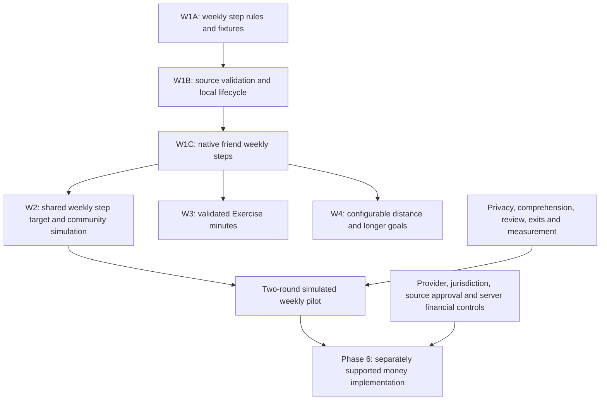

# Build friend duels and personal performance commitments

Updated September 6, 2026. The owner adopted this model; Phase 1A's isolated local
agreement backend and Phase 1B's opt-in native flow are accepted locally.
Phase 2(a–e)'s evaluator, private proof/operator boundary, simulated lifecycle,
native results, rematches and invitation links are implemented locally. Phase
3(a–e)'s commitment agreements, attempts, manual progress, following and lifecycle backend are implemented locally; the
default app remains Personal.
[BUSINESS_MODEL.md](docs/BUSINESS_MODEL.md) defines the two
journeys, recommended rules, funds-flow options, source research and pilot.
[PROJECT_MEMORY.md](PROJECT_MEMORY.md) records intent; D123 in
[DECISIONS.md](DECISIONS.md) records the original decision. D131 records this
weekly-first planning revision, while D130 engagement requirements remain in force.
The detailed [weekly specification](docs/WEEKLY_CHALLENGES_IMPLEMENTATION_PLAN.md)
owns the new W1–W4 requirements. The [execution record](docs/WEEKLY_EXECUTION.md)
and [local acceptance record](docs/WEEKLY_LOCAL_ACCEPTANCE.md) distinguish current
implementation, executed checks and gates that remain unperformed.

The previous 502-line plan is preserved verbatim under its archive header in
[the pre-pivot plan](docs/archive/2026-09-04_PRE_PIVOT_PLAN.md). Historical
Personal, Solo and charity agreements retain their original meanings. Old
milestone numbers M0–M12 and completed slices of Phases 0–3 are historical. W1–W4 define
the new recommended work; Phase 6 retains the requirements for actual money.

## Starting point and boundaries

At the Phase 0 planning baseline, the app ran seven-day Apple Health steps
challenges with internal test-only or Stripe sandbox payment behavior. It had
no new running duels or performance commitments. The completed local slices
below extend that baseline; Garmin integration, funded deposits and winner
payouts remain unimplemented. The original planning inspection used local
`c403b88` and existing owner guidance changes.
Previous test counts and hosted observations are historical evidence, not
checks rerun for this plan. See the code inventory in
[BUSINESS_MODEL.md](docs/BUSINESS_MODEL.md#repository-inspection-reuse-and-gaps).

Current direction: participant-selected distances/targets and separately
validated metric policies; no mandatory fixed 5K. The recommended build sequence
is weekly friend steps, one community experiment, Exercise minutes and custom
distance goals. The owner selected a beta friend cap of five and a common
weekly community step goal (D132); five total participants and individual
completion of that same goal are explicit working interpretations. The numeric
community target, rollout clearance and real-money terms remain unselected. Historical 5K
phases record what was built, not the future launch format. Keep their
agreements intact.
Use [responsible engagement](docs/BUSINESS_MODEL.md#responsible-engagement-and-commercial-incentives)
as acceptance requirements for all new work. New prices, timing rules, limits
and pilot thresholds remain recommendations. Live money, deployment, publication,
recruitment and provider contact remain separately gated.

Keep the existing Personal app usable and its records readable. Do not widen
old settlement enums, unfreeze terms, convert charity obligations to prizes,
change the Personal step policy, turn on dormant Solo, or copy old social UI
wholesale. New backend capability must be default-off and separately admitted;
a client toggle alone is insufficient. “Simulated” means no redeemable balance,
provider object, charge, transfer, external settlement, or prize of value.

## Current implementation order after the engagement review

This order incorporates the weekly-challenge discussion and supersedes the old
organizer-first dependency chain. The owner subsequently authorized all feasible
local W1–W4 implementation, beginning with W1A. Separate fictional weekly
contracts, local lifecycle/native work and source/metric prototypes are now
implemented and locally verified within their fictional boundaries as recorded below. No full stage
is accepted while its required device, human or pilot checks remain missing.
Completed slices of Phases 0–3 and their tests remain implementation history. Unfinished
organizer nomination screens are paused as the default next task.

| Order | Deliverable and dependency | Exit requirement |
| --- | --- | --- |
| Completed | Agreement comprehension and dormant push cleanup | Preserve the [existing engagement changes](docs/RESPONSIBLE_ENGAGEMENT_ACCEPTANCE.md), consent, full rules and disabled push. |
| W1A — implemented | Pure fictional weekly-steps rule model, qualification evaluator and fixtures | 2–5 participants total (working interpretation of the beta cap), individual agreed cumulative targets, seven frozen calendar dates, explicit incomplete data and deterministic decisions. No operational finality or money ledger. |
| W1B | Validate the actual step source; add separate local weekly agreements, observations, lifecycle/review and simulated outcomes | Physical-source evidence is separate from fictional tests. Exact consent/retries, privacy, corrections and weekly overlap are verified. No old-policy changes. |
| W1C | Opt-in native friend weekly challenge, progress, results/review and deliberate next-week invitation | Two- and five-participant local acceptance, frozen roster and capacity, clear terms, recoverable requests, account isolation, exits, accessibility and source freshness. |
| W2A–B | Owner-selected single official weekly steps community cohort: one common target, enrollment, multi-person simulation, native join and descriptive pilot | Solo joiners can participate; everyone individually works toward the same published step target, no financial leaderboard, all/none/some-winner handling and privacy. Rollout clearance remains separate. |
| W3 | Separate Apple Watch Exercise-minute policy and adapter, then native support | Manual/imported ring credit and source lineage validated on devices; no workout-duration substitution. Source research may run earlier. |
| W4 | Participant-selected cumulative distance and timed-distance policies; relevant longer-goal progress/following | Each format has its own units, proof and comparison rules. No mandatory 5K or organizer catalog; no relabeling old agreements. |

Full contracts and acceptance matrices are in
[the weekly specification](docs/WEEKLY_CHALLENGES_IMPLEMENTATION_PLAN.md).
Integrate in dependency order, with one migration/shared-contract owner and
independent review. Consult the [execution checklist](docs/WEEKLY_EXECUTION.md)
for slice status; historical shared foundations do not prove a new mode works.

**Cross-cutting work remains required:**

- Reuse native private progress and selected-following patterns once they have
  the new format to follow. Manual check-ins never become qualifying proof.
  The full historical event-nomination/milestone UI is not a W1 prerequisite.
- Before external reminders, implement category preferences and contextual OS
  permission, quiet hours/caps, server suppression/deduplication and current
  authenticated routing. Cover refusal, timezone changes, revocation, stale
  events and sign-out. Optional categories start off; durable in-app result/
  review notices remain available. No inert preference UI or automated consent.
- Before recruitment, implement minimal first-party instrumentation and report
  comprehension, fairness, meaningful progress, voluntary return, pressure,
  unwanted notifications, privacy and exits. Do not optimize return after loss
  or paid frequency. The initial two-round pilot is descriptive, not a powered
  experiment or evidence of behavior under financial stakes.
- Before real-money admission, implement server aggregate outstanding and
  rolling-new-commitment limits plus pause across friend, community and personal
  products, including previous weeks awaiting finality. Select numeric caps,
  windows and delayed increases with the funded policy. Immediate decreases/
  pause preserve existing history, review, exits, support and money access.
  Test concurrent create/join/accept/rematch, retries and gate-off. Phase 6's
  provider, jurisdiction, platform, source and rollout requirements still apply.

## Architecture recommendation

The implemented `duel_*` and `performance_commitment_*` contracts remain
separate from legacy `contests`/`personal_challenge_terms` and `solo_contracts`.
New weekly agreements and later community participation require their own
versioned terms, requests, admission and lifecycle projections. Do not widen old
exact-5K decoders, two-person settlement enums or pending requests. Reuse durable
identities and tested infrastructure patterns. The reserved legacy
`social_accountability` discriminator remains unused. The new `weekly_*_v1`
contracts and private `app.weekly_*` domain isolate fictional friend/community
steps from those historical agreements. Real Health observations are not
admitted as complete qualifying proof.

Freeze agreement policy/version/digest, source definition, exact UTC window and
display zone, rule precision, consent, simulated amount, and deadlines. Preserve
requests in a product-specific namespace. Separate agreement, attempt/proof,
result, review and financial events. Extract shared proof types only when both
products need the same tested behavior; do not build a generic contest DSL.

Reuse `profiles`, friendships/blocks and active-actor checks. Use explicit RLS,
owner/participant projections and narrowly granted RPCs; service authority
must not be reachable by an ordinary client. Reuse idempotency and deletion
patterns, not old agreement data. Terms and policy versions are immutable;
corrections append. Keep raw proof private from opponents and followers.

The historical local products cap participation at one unsettled duel plus one
performance commitment per person. Those original slot rules stay unchanged.
These historical slots never consume or release Personal/Solo slots. A creator
reserves their duel slot on invitation; the invitee reserves theirs only on
acceptance. Pending incoming invitations do
not occupy a slot. Close slots on terminal new-product outcomes, including
expiry and simulated withdrawal; lock both actors in stable order for races.

For new weekly products, separate overlapping activity enrollment from pending
result/review. A person may explicitly join the following nonoverlapping week
while the prior week finalizes. Define bounded pending admission and future
aggregate financial limits; do not truncate reviews, grant unlimited exposure
or count a friend's community view as a second enrollment.

## Dependency order



W3/W4 source research can run earlier; neither Garmin nor official-event
integration blocks W1. Each mode needs its own observed source and pilot evidence
before its funded version can pass Phase 6. External reminders have their own
complete preference/delivery gate and are not required for local simulation.

## Historical implementation record

Phases 0–3 below retain the completed work and remaining format-specific
acceptance. Their original numbered dependencies and fixture prices describe
that implementation. They do not supersede W1–W4 or authorize continuing the
organizer-event UI. Phase 4 is source-expansion reference work; Phase 5 now
points to the revised weekly pilot. Phase 6 remains a current cross-cutting gate.

## Phase 0 — planning and rule selection

**Status: complete as documentation only.** Business model, inspection,
reversible defaults, historical plan archive and precedence reconciliation are
in this change. Payment recipients/providers/jurisdictions remain open in the
decision register below. No implementation phase is complete merely because
its source files or acceptance criteria are named here.

<a id="phase-1a--local-simulated-duel-agreement-recommended-first-slice"></a>

## Phase 1A — local simulated duel agreement (historical completed slice)

**Status: implemented and verified locally.** See
[the acceptance record and Phase 1B handoff](docs/DUEL_AGREEMENT_V1_ACCEPTANCE.md)
for the RPC contract, runnable two-actor example, tests and remaining boundaries.
Admission resets off with an empty allowlist; no hosted rollout is implied.

**Depends on:** Phase 0. No Garmin, payment provider, hosted project or physical
device needed. Outcome: two authenticated local actors can create and accept
one identical, versioned simulated 5K agreement.

**Code areas:** one or more new forward migrations under `supabase/migrations`
created with `supabase migration new`; new `supabase/tests/*duel_agreement*`
and `*duel_agreement_concurrency*`. Read the identity/social migration,
`20260727030649_m8_1_live_social_loop.sql`,
`20260803001455_solo_contract_rpc_boundary.sql`, and D81 deletion code for
patterns. Do not edit applied migrations or expose existing charity RPCs as duels.

**Smallest reviewable work:**

1. Define immutable `duel_policy_versions`, a service-curated fictional event
   fixture, `duel_challenges`, exactly two named participant rows, private
   request/enrollment records, an authoritative default-off runtime gate and
   empty beta allowlist. Policy fixes `fixture_official_5k_v1`, 5,000 m,
   whole-second chip timing, USD 2,000 simulated cents each and fee zero.
   No arbitrary public title/URL upload or live settlement parameter.
2. Add versioned create, accept, decline, pre-start cancel and list/detail RPCs.
   Creator accepts when creating; invitee explicitly names the current policy
   version and digest on acceptance. Reads expose identical agreement facts
   to the pair, no unrelated profiles or financial/private records.
3. Use server time: event in future and within 30 days, common event window,
   accept cutoff `min(created_at + 72h, starts_at - 1h)`, strictly future at
   creation. Reject requests at/after cutoff. Persist accepted state as
   `scheduled`; activation/scoring comes later. Expiry can be a clock-injected
   private transition tested manually, with no cron registration. Ensure
   a subsequent creation atomically expires any overdue creator reservation
   before claiming the slot. Reads can expose that expiry is due without
   mutating state; Phase 2 adds the scheduled expiry worker.
4. Exact retries recover a prior committed request for the same active actor,
   even after time/gate changes; changed payload under the same key fails.
   Deleted actors still lose access. Serialize slot/accept/cancel/delete races.
   Pre-start deletion cancels the simulated agreement without changing old
   account-deletion rules. Preserve minimal tombstoned agreement history.

**Acceptance:**

- Local actor A creates for accepted friend B; both read matching frozen terms;
  only B can accept, before cutoff, once. Decline/expiry/cancel remain recorded.
- No third participant, self-duel, blocked pair, inactive actor, unknown event,
  unsupported metric/source, nonzero fee, changed amount or live mode can enter.
- No two concurrent requests reserve two new duel slots for either actor;
  accept versus cancel/expiry/deletion yields one valid outcome.
- `anon`, unrelated actors, direct writes and unauthorized service operations
  fail. RLS covers new exposed tables; security-definer grants/search paths
  are explicit. No raw proof, payment identifiers or credentials are stored.
- Fresh reset defaults leave creation disabled and allowlist empty; test setup
  enables only fictional local actors within isolated fixtures.
- Gate-off blocks new creation/acceptance, not authenticated history reads,
  exact committed recovery or safe pre-start cancellation of an existing row.
- Existing Personal, Solo and charity fixtures/results/obligations remain intact.

**Verification:** focused pgTAP including two real sessions for races, then full
`./scripts/db-test.sh` (local disposable DB only), schema lint/advisor review
as available, and `git diff --check`. Test same-request/different-payload,
cutoff equality, timezone/DST display independent of event instants, stale JWT,
blocked and deleted actors, atomic rollback and exact recovery after gate-off.
No Xcode/UI tests required because no UI changes. If a tool/dependency is
unavailable, record the unrun gate and do not claim it passed.

**Exit artifact:** migrations, deterministic fixtures, runnable two-actor local
example and test results. Update README's implemented state. No Edge endpoint,
iOS feature, scheduler, provider integration or hosted switch is part of 1A.

## Phase 1B — native create, invitation and acceptance

**Status: accepted locally, September 4, 2026.** The opt-in native flow passed
the authenticated two-account native-to-local-HTTP smoke, including identical
consents, account switching, stale responses, durable exact-request recovery,
gate-off rejection and safe cancellation. See
[the native acceptance record](docs/DUEL_NATIVE_V1_ACCEPTANCE.md) for reproducible
commands and evidence. VoiceOver and physical-device checks remain unverified;
Release and hosted admission remain closed. Phase 2(a) is now implemented below.

**Depends on:** 1A's stable RPCs and local privacy proof.

**Code areas:** add `DuelModels.swift`, `DuelClient.swift`, `SupabaseDuelClient.swift`,
`DuelStore.swift`, `PendingDuelRequestStore.swift`, and creation/detail views in
`ios/GameTime/GameTime`; wire `AppClients.swift`, `AppRouter.swift`,
`AppShellView.swift`, `AppConfiguration.swift` and `FixtureClients.swift`.
Reuse `SupabaseClients.swift` friendship methods after inspecting ownership and
block behavior. Retain `PendingPersonalChallengeStore.swift` and
`PendingChallengeStore.swift` as separate legacy formats.

**Slices:** first fixture creation/review/receipt; then local authenticated
friend selection, incoming invitation/detail and accept/decline; then durable
mutation recovery and routing. Initially select an existing accepted friend;
friend discovery/share-link growth comes after the basic pair works.

**Acceptance:** pair sees same event, date, timing basis, cutoff, cancellation,
review rules and “Simulated stakes — no real money moves” at consent. Normal
Personal paths and history still work. Refresh/offline/ambiguous response and
account switching cannot duplicate or leak a duel. No hidden legacy charity
call, payment setup or unsupported future feature is offered. New route remains
unavailable in Release and on servers without admission.

**Verification:** product model/DTO and persisted-envelope tests; fixture UI
journeys for both actors; accessibility/Dynamic Type; Debug/Staging/Release
builds and configuration rejection tests. Scope `assertNoForbiddenLanguage`
and `scripts/check-beta-candidate.sh` to retained Personal screens, adding
explicit duel assertions instead of removing protection. Local two-account
smoke proves API wiring; simulator proof does not establish real race results.

## Phase 2 — official proof to credible result and rematch

**Status: local simulated slices (a/b/c/d/e) complete.** The pure versioned evaluator
and fictional Deno matrix cover the frozen agreement, official results,
nonfinishes, unresolved proof, corrections, independent review and deadline
decisions. See [the Phase 2(a) acceptance record and next-slice handoff](docs/DUEL_SCORING_V1_ACCEPTANCE.md).
Private append-only fictional sources, independently reviewed proof revisions,
per-duel operator grants/revocations and participant receipt reads are now
implemented with a separate default-off gate. See [Phase 2(b) acceptance and the
next-slice handoff](docs/DUEL_PROOF_V1_ACCEPTANCE.md). Slice (c) now adds a
default-off local worker, durable in-app notice records, participant cases and
independent resolutions, safe exits, immutable final results and separate
nonredeemable simulated settlement. See [Phase 2(c) acceptance](docs/DUEL_LIFECYCLE_V1_ACCEPTANCE.md).
Slice (d) now adds actor-bound native progress/results, durable notice rendering,
participant review requests and safe exits, with exact recovery and blocked-contact
suppression. See [Phase 2(d) acceptance](docs/DUEL_NATIVE_LIFECYCLE_V1_ACCEPTANCE.md).
Slice (e) adds fresh-consent rematches, a new event and expiring/revocable
invitation links that only the named friend can resolve. Native pending links
survive login; opening never accepts. See [Phase 2(e) acceptance](docs/DUEL_REMATCH_LINK_V1_ACCEPTANCE.md).
**Phases 3(a/b/c/d/e) are implemented below.** Native commitment integration
remains a separate implementation task.
Real organizer/reviewer operation, hosted schedules, universal-link hosting
and external notice delivery remain unimplemented and separately gated.

**Depends on:** 1A–1B. Before a human pilot, select one organizer/event/source,
permission to use results, an independent reviewer and a support process.

**Code areas:** new versioned event/proof/result/review tables and RPCs;
`supabase/functions/_shared/duel_scoring.ts` plus fictional fixtures;
new worker/handler only after pure evaluation is stable. Extend notification
outbox and `deliver-push` with explicit new-entity dispatch, not charity event
aliases. Add duel progress/result/review/rematch views and tests. Reuse
`210_m8_3c_standings_results_obligations.test.sql` locking/redaction patterns
without invoking its obligation publisher.

**Slices:** (a) pure official-result evaluator; (b) private reviewer proof
submission with an audited narrow operator role; (c) clock-injected activation,
cutoff, provisional/result/review/finality worker; (d) native progress, in-app notices and participant review; (e) explicit new-consent rematch and target-bound share link.
Links expire/revoke, preserve a pending destination across login, reveal no raw
proof and never accept on behalf of a user. Native share is initiated by the
person; no automatic messages or contact imports.

**Acceptance:** every outcome in the business-model rule table is reachable,
including tie, one/both DNS/DNF, missing records, wrong bib, official correction,
injury/withdrawal, reviewer timeout and event cancellation. Settlement remains
simulated and separate from result. Corrections are append-only. Reviewer
cannot decide their own contest. The finality cap prevents endless revisions.
Blocked/deleted actors, stale links, unauthenticated reads and unrelated users
cannot gain access. A rematch requires both consents and a fresh event/time.

**Verification:** pure Deno fixture matrix at boundaries; SQL RLS, role grants,
result immutability, evidence-cutoff/correction/dispute races, worker reruns and
simulated-value conservation; notification idempotency and no private payloads;
native result, review deadline and rematch UI. Run full portable gate once at
integration and relevant Xcode checks. No hosted schedule is activated here.

## Phase 3 — longer personal performance commitments and followers

**Slice (a): implemented and verified locally as an agreement backend.** See
[the acceptance record and Phase 3(b) handoff](docs/PERFORMANCE_COMMITMENT_AGREEMENT_V1_ACCEPTANCE.md).
Private versioned terms, digest-bound owner consent, a separate one-open slot,
exact requests, owner reads, safe exits and deletion retention are implemented.
The local policy uses 28–90 elapsed UTC days, a strictly future start within
30 elapsed days, fictional official 5K chip times and $20 nonredeemable
simulation with fee zero and an unselected recipient. These are reversible
implementation defaults. Admission resets off. Deadline passage keeps the
agreement open awaiting proof; no automatic miss or settlement is inferred.
**Slice (b): implemented and verified locally.** Nominated fictional 5K events,
private independently reviewed proof corrections and a pure strict-target
evaluator now use their own default-off boundary and retention scope. Any
qualifying success survives later slower attempts. Missing proof is distinct
from a miss, which requires explicit complete-set/no-attempt confirmation and
the frozen review windows. No result publisher, lifecycle worker or slot release
was added. See [attempt acceptance and the Phase 3(c) handoff](docs/PERFORMANCE_ATTEMPTS_V1_ACCEPTANCE.md).
**Slice (c): implemented and verified locally.** Named milestones, manual
check-ins and append-only completion/reopening/retirement now use a separate
default-off owner ledger. Exact requests, bounded history with stable pagination,
active session checks and a distinct retention hold preserve safe exits and
deletion behavior. Progress never enters organizer proof or scoring snapshots.
See [progress acceptance and the Phase 3(d) handoff](docs/PERFORMANCE_PROGRESS_V1_ACCEPTANCE.md).
**Slice (d): implemented locally as a backend.** Bilateral friend consent,
explicitly selected progress cards, permanent revocation, structured reactions,
personal pull-based in-app reminders and private report/support boundaries now
use a separate default-off gate. Blocks, unfriending, deletion and safe closure
end follows. Private notes, amounts and proof are never shared. See
[following acceptance and the native/Phase 3(e) handoff](docs/PERFORMANCE_FOLLOWING_V1_ACCEPTANCE.md).
**Slice (e): implemented and verified locally as a backend.** Complete proof
snapshot commits now persist durable owner notices, independent reviews,
withdrawal/deletion history, immutable finals and separate simulated
consequences. A clock-injected manual worker preserves full correction/review
windows; finality releases the commitment slot and ends existing follows.
Post-final support has separate scoped grants and cannot change outcomes.
See [lifecycle acceptance and the native handoff](docs/PERFORMANCE_LIFECYCLE_V1_ACCEPTANCE.md).
**Slice (f), first native step:** opt-in local goal preview/consent, owner
agreement history, saved result notices/reviews, safe exits and separately
recorded simulated amounts. Typed contracts and actor-bound exact requests
preserve the separate lifecycle's authority and clear content on failed reads.
See [native implementation and remaining handoff](docs/PERFORMANCE_COMMITMENT_NATIVE_V1_ACCEPTANCE.md).
**Historical native handoff, paused as the default next task:** organizer-event
nomination/completeness, private milestones/check-ins and selected following.
Preserve its acceptance requirements; use W1–W4 to decide when relevant portions
are adapted. New weekly steps do not depend on completing the organizer flow.
The whole native integration is not complete. Physical-device/VoiceOver
acceptance, actual organizer and retention/support operations remain open.

**Depends on:** Phase 2's proof/review foundation; does not depend on Garmin.

**Code areas:** new `performance_commitment_*` policy, terms, milestone,
attempt-link, result and review migrations; new Swift `PerformanceCommitment*`
client/store/models/views and pending-request format. Add follower permissions
and bounded projections using friendships/blocks. Extend account deletion and
retention with new workflow scopes. Keep `solo_contracts`, `solo-test-v1`,
Personal's seven-day snapshots and their schedulers unchanged.

**Slices:** (a) 28–90-day terms and one-open constraint; (b) multiple nominated
event attempts and strict target evaluation; (c) named intermediate milestones
and manual progress; (d) opt-in friend following, structured reactions,
reminders, report/block/support; (e) commitment result/review/withdrawal history.
The implemented fixture remains official 5K chip time. New metric policies
follow the current order above; true-mile support needs exact metre/unit and
sub-six-minute boundary fixtures, without requiring a 5K launch first.

**Acceptance:** a 60-day goal works without seven-element arrays or fixed
168-hour arithmetic. Only post-agreement, pre-deadline qualifying attempts
count; 360 seconds exactly misses a strict sub-six-minute goal. Milestones do
not settle money. Missing proof is distinct from a proven miss; a successful
attempt remains valid unless explicitly corrected. No forfeiture recipient is
implied while unselected. Followers cannot view raw proof or alter terms;
revocation removes future follower access. Deletion/purge does not prematurely
remove evidence required for open goals or cases.

**Verification:** SQL lifecycle/RLS/concurrency and retention tests, shared pure
proof fixtures, end/deadline/DST/leap-date tests, Swift separate-envelope and
cross-account cache tests, fixture UI for progress/attempts/withdrawal/review.
Test one new duel plus one new commitment with an existing Personal history,
without changing old slots or enabling Solo. Observe a 28-day commitment in
the pilot; accelerated clocks do not prove months of actual retention.

## Phase 4 — asynchronous workouts and source expansion

**Reference workstream for W3/W4.** The Garmin sequence below applies only if
that source is selected. W1 uses a separate Apple steps investigation and does
not depend on provider access or an official event.

**4A feasibility depends on:** Phase 0 only; actual applications/contact need
separate owner authorization. Read current official Garmin documentation and
obtain approved evaluation access and use-case permission before integration.
Confirm original device identity, edits/imports/deletions, event timestamps,
distance series, pause semantics, delivery/retry/backfill behavior, consent,
revocation, quotas and commercial terms from real approved samples. The public
FAQ is not an API payload contract or approval.

**4B implementation depends on:** a passed 4A source decision and the result/
review domain in Phases 2–3. Add isolated `running_attempts`/proof revisions,
provider connections/tokens in private storage, and an adapter such as
`supabase/functions/garmin-activity-ingest`; build fixtures before any connected
calls. OAuth callback, scoped consent, webhook validation as specified by the
provider, replay/deduplication and reconciliation are separate slices. For an
Apple Watch source, add a dedicated workout reader and permissions; do not
broaden `PersonalHealthStepReader` or daily snapshot RPCs.

**Acceptance:** the selected source supplies all required fields; otherwise the
policy remains unavailable. No HTML scraping or unapproved unofficial Garmin
API. Distinguish elapsed, moving and active time; no weighted-minute crosswalk.
One source and policy per challenge; no silent Apple/Garmin substitution.
Document measured course/GPS tolerance, pauses, terrain, sensor gaps, edited
records and credible miss detection before enabling asynchronous comparisons.
Validate the selected distance/metric directly; do not require a preceding
5K launch. Handicaps and consistency formats need their own proof and rest rules.

**Verification:** adapter contract tests from approved redacted samples;
forgery, replay, revocation, partial/late/out-of-order upload and deletion cases;
field trials comparing devices with organizer/measured-course references;
short-distance error, pause, car/cycle, duplicate import and clock manipulation
cases. Record false rejects/accepts and reviewer load. Simulator or OAuth
success alone does not qualify a source for cash settlement. A controlled
provider/environment pilot is a separately approved action.

## Phase 5 — simulated user-validation pilot

**Revised proposal:** 20–30 adults over two consecutive seven-day rounds, using
one official weekly community cohort and including solo joiners and friend
groups of 2–5. Depends on W1B/C source and native acceptance, W2 community/privacy/
allocation acceptance, support/exit readiness and a separately approved
recruitment/distribution candidate. No real entry fees or prizes. See
[the pilot contract](docs/BUSINESS_MODEL.md#user-validation-pilot).

Before W2 exists, 2–5-participant W1 local usability checks can validate consent and
progress, but cannot establish community demand. If the community experiment
is deferred, a separately cleared two-round friend-only W1 pilot can proceed;
W2 is not a prerequisite for private-format evidence or its payment research.
Longer commitments retain a later pilot appropriate to their durations;
two weeks cannot prove long-term
retention or outcomes under real money.

Use minimal first-party events with intent/exposure/outcome, denominators,
deduplication and privacy checks. Report agreement comprehension, individual
completion, source missingness, perceived goal fairness, own-result clarity,
voluntary week-two participation and invitations, review workload, pressure,
unwanted contact and ease of leaving. No targets for return after loss, paid
frequency, committed amount or daily app opens. Report nonresponses explicitly.

Proceed only when comprehension, source/result credibility, privacy and exit
controls pass. Investigate pressure/coercion or broken review before expanding.
Mock data, passing tests and proposed cohort counts are not actual pilot evidence.
Hosting, invitations to testers, external delivery and payment work remain
separately gated. This plan does not perform any of them.

## Phase 6 — payment feasibility, then separately gated implementation

**6A can proceed independently as research.** Decide each product separately;
see funds flows and official sources in [BUSINESS_MODEL.md](docs/BUSINESS_MODEL.md#payment-model-decisions-and-options).
Ordinary Stripe is not presumed suitable for prize duels. Its current policy
lists prize-bearing skill competitions and certain entry fees as prohibited;
its existing sandbox and Connect APIs confer no permission. A saved method is
not locked money. Long card holds are not a deposit design.

**6B depends on:** explicit supported provider/funds flow, jurisdiction and
platform analysis plus evidence for the exact funded format from the revised
Phase 5 or its W3/W4 follow-up pilot. Only then build a separate provider
sandbox adapter, ledger and consent version. Reuse `personal-stripe-sandbox-*`
patterns for idempotency/signatures/review while leaving those handlers,
consent and test-only guards intact. Use no real credentials or live objects.

**Slices:** funding/partial-funding rollback; immutable beneficiary/fee consent;
provider event reconciliation; independent result-to-payment authorization;
refund and payout handling; chargebacks/reversals; operator controls and
support recovery. Simulate expired holds, denied charges, unavailable payouts,
duplicate/reordered events, timeout after provider success, and case reopening.
Never state a winner was paid until provider reconciliation confirms it.

**6C live gate — all required, none currently cleared:**

- Legal entity, country/state allowlist, adult age rule, identity/location
  enforcement, contest classification and all required permissions for each
  product. Default jurisdiction allowlist remains empty.
- Written provider support covering stakes, prizes, beneficiaries, commitment
  duration, custody, fees, cancellations, refunds and disputes. Name who bears
  chargebacks and handles frozen/insolvent funds; no assumed escrow protection.
- Decide personal forfeiture recipient and funded deposit versus later charge.
  Both are honest options but need different consent and failure handling.
- Apple review of payment classification, rules/non-sponsorship disclosure,
  sensitive health-data use, moderation and injury design; storefront analysis
  for any digital club subscription. A renamed “service fee” is not clearance.
- The exact source policy has demonstrated sufficient verification, including
  missing-data abuse and correction handling; independent review has staffing,
  audit and deadlines. Simulated withdrawal defaults are replaced by a new
  explicitly approved funded policy, never silently changed for old rows.
- Server-enforced aggregate exposure/new-commitment limits, voluntary pause,
  deliberate delayed increases, and continued history/review/exit/money access
  pass concurrent admission and recovery tests.
- Provider sandbox, money conservation, reconciliation, refunds, payout failure,
  rollback/kill switch, age/location bypass and support drills pass.
- Explicit approval for the exact hosted rollout and distribution, followed by
  staged acceptance and a separately approved capped live trial. An accepted
  plan or a green local suite never flips this switch.

If any of these cannot be met, keep simulation available and revise the funds
flow transparently. Do not deploy a workaround or convert existing agreements.

## Material decision register

| Decision | Recommended next action / owner | Blocks |
| --- | --- | --- |
| Weekly steps source and confirmed-miss rule | W1A uses fiction; W1B validates source identity, merging, corrections and incomplete-data handling on devices | Real-source weekly admission; not pure fixture work |
| Community scope, target fairness and pool rules | W2A selects the shared numeric weekly target and tests identical terms, minimum/capacity, all/none/some-winner and unallocated simulation rules | Community pilot; not W1 friend steps |
| Weekly deadlines and participation limits | W1B freezes full review windows and bounded future-week admission; Phase 6 includes pending prior weeks in exposure | Weekly lifecycle and later money |
| Garmin access and permitted use | Owner authorizes application; engineering validates approved fields and source lineage | Phase 4B |
| Asynchronous distance tolerance and proof of miss | Engineering + reviewer field trials; freeze policy after evidence | Async contests and all cash based on that source |
| Configurable-distance format, course variation and handicaps | W4 separates accumulated distance from timed attempts; validate chosen distance without a fixed-5K prerequisite | Distance expansion; not weekly steps |
| Deposit versus later charge and forfeiture payee | Owner + counsel + provider; beneficiary hypothesis first, no recipient selected | Personal real-money agreement |
| Friend/community payment provider, fund holder and liability | Owner + counsel verify the exact supported structure; pooled stakes and multiple winners need separate analysis | All funded social formats |
| Jurisdiction, age/identity/location, taxes and consumer terms | Qualified counsel and owner; no region enabled by default | Every live mode |
| Fees and club pricing | Test stated preferences, costs and later cleared actual conversion | Commercial launch pricing |
| Injury, withdrawal, corrections, missing proof under stakes | Product + independent review + counsel; test adversarial cases | Real-money policy |
| Hosted/device status and legacy maintenance obligations | Engineering rechecks only in an approved implementation/acceptance task | Distribution claims; not planning completion |

## Verification and documentation policy

For each implementation PR record what changed, code tests, unrun checks and
what only real devices/hosted operation/users can establish. Use the current
commands in README and `.github/workflows/ci.yml`; `scripts/test-all.sh` covers
portable suites, not Xcode. Database reset is for a disposable local stack.
Run focused tests then the appropriate integration gate; do not inflate test
counts or rerun unrelated suites after documentation-only edits.

Every phase must preserve old agreement invariants and new default-off gates.
Local RLS tests require authenticated actors, not only service/superuser reads.
Concurrency needs separate sessions. Clock-controlled tests exercise cutoff
boundaries; hosted Cron firing requires an actual approved observation. Physical
Health, OAuth/provider behavior and actual demand each need their own evidence.
Never log access tokens, raw health/route data, card details or private dispute
material. Review changed Markdown links, status labels and `git diff --check`.

The active Personal beta runbooks remain maintenance/acceptance references for
that implementation. Their solo-only and no-payout future rules are superseded
by D123; their no-live-money restrictions remain. Design mockups remain visual
references, not implementation proof or new product constraints.

## Current next implementation task

Continue from the [verified local status and remaining gates](docs/WEEKLY_LOCAL_ACCEPTANCE.md),
not from the historical W1A-only prompt. Complete any pending local acceptance
before claiming a slice accepted. The exact next external work is a recorded
physical-device source matrix, human accessibility/comprehension checks and a
separately authorized two-round pilot. Source-dependent metric selection,
external reminders and funded admission remain disabled until their own gates
are satisfied. Organizer-event nomination screens remain paused.

## Historical Phase 1A implementation prompt — already completed

Retained for provenance. Do not execute this as the next task; use the current
implementation order above. Its fixed-5K defaults are historical.


```text
Work in /Users/user/Documents/GitHub/GameTime.

Implement only PLAN.md Phase 1A: the local simulated same-event 5K duel
agreement backend. Friend duels and personal performance commitments are the
adopted model; do not ask to reconfirm the pivot.

Read AGENTS.md, PROJECT_MEMORY.md, CLAUDE.md, docs/BUSINESS_MODEL.md, PLAN.md,
and DECISIONS.md D123. Inspect git status and preserve all unrelated changes.
Follow the repository's forward migration workflow and read its Supabase skill.

Deliver new isolated duel policy/agreement/participant/request/enrollment
records and versioned create, accept, decline, pre-start cancel and list/detail
RPCs. Use existing durable actors and accepted friendships with block checks.
Do not reinterpret contests, personal_challenge_terms, solo_contracts, old
pending requests, scoring or charity obligations. No applied migration edits.

Use one service-curated fictional outdoor 5K event policy:
fixture_official_5k_v1, 5,000 metres, common whole-second organizer chip times,
exact future event window within 30 days, exactly two named friends, simulated
USD 2,000 cents each and zero fee. Store no proof or provider data in this slice.
Create records creator consent; the invitee accepts the identical policy
version and full terms digest. Cutoff is the earlier of creation + 72 hours
or event start - 1 hour; equality is too late. Both accepted means scheduled.
Implement clock-controlled expiry without registering a scheduler.

Freeze terms and maintain exact-request idempotency, changed-payload refusal,
one unsettled new duel per actor, stable locking and atomic rollback. Incoming
invitations reserve no invitee slot until acceptance. Expiry must release the
creator slot. Same-actor committed retries can recover after gate/cutoff changes;
deleted actors cannot recover private access. Cover pre-start deletion while
preserving tombstoned agreement history and old deletion behavior.

Gate-off blocks new creation/acceptance but preserves safe cancellation,
authenticated history and exact committed recovery. Subsequent creation must
atomically expire an overdue creator reservation before claiming a new slot.

The authoritative runtime gate defaults off; the allowlist defaults empty.
Enable only fictional actors in isolated local tests. The server fixes simulated
mode and rejects any live mode or arbitrary amount/fee/source. Use explicit RLS,
minimal grants and guarded service authority; clients cannot write base tables.

Add meaningful pgTAP and two-session concurrency tests for the Phase 1A
acceptance matrix, including unrelated/anonymous/deleted actors, blocked pairs,
exact retries, payload conflicts, cutoff equality, acceptance/cancellation/
expiry/deletion races and slot conflicts. Run focused checks, the full local
DB suite and relevant lint/advisor checks; record unavailable checks honestly.
Include a runnable two-actor local example and update implemented-state docs.

No iOS feature, Edge endpoint, workout ingestion, scoring, payment adapter,
cron registration, hosted mutation, deployment, publication or live money.
Finish with files changed, verification results and the Phase 1B handoff.
```
