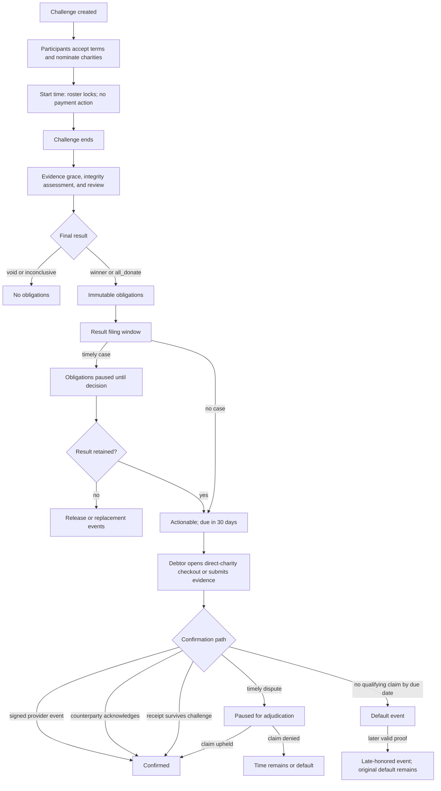

# Charity pledge and donation implementation plan

> Status: proposed implementation sequence, 2026-07-30.
>
> This plan extends the existing M7/M8.3c foundation. Product rules in
> [DECISIONS.md](../DECISIONS.md), especially D74 through D82, remain
> authoritative. This document does not authorize production payment collection
> or change the current no-money behavior.

## Outcome

GameTime will remain a pledge-and-verification product:

- A participant accepts a fixed USD pledge and a closed set of possible charity
  destinations before a challenge starts.
- Starting a challenge locks the roster and terms. It does not charge,
  authorize, save, or hold a payment method.
- A trusted final result creates immutable donation obligations only for
  `winner` and `all_donate` outcomes.
- An obligation becomes actionable only after the result filing window closes
  and every timely result dispute is resolved.
- The debtor initiates a donation directly to the charity or an approved
  platform charity. GameTime never receives or holds donation proceeds.
- A signed provider confirmation, counterparty acknowledgement, or qualifying
  receipt path can confirm the pledge as honored.
- Disputes, releases, reinstatements, defaults, late honor, refunds, and
  chargebacks append events. They never rewrite history.

The first launch should support provider-hosted Apple Pay and major US
credit/debit cards when the selected charity supports them. ACH is a later
addition. Cash, check, employer match, and donations made outside the integrated
provider remain evidence-based claims rather than GameTime-processed payments.

## Non-negotiable product boundary

1. Do not call the commitment a bet, wager, odds, pot, payout, or debt in product
   copy, provider applications, APIs, or support material.
2. No participant receives money, property, credits, or another material prize.
3. GameTime does not collect everyone at the start and later refund winners.
4. GameTime does not provide escrow, a wallet, stored value, peer-to-peer
   transfers, or automatic future debits.
5. GameTime takes no percentage from charitable donations. A future GameTime
   subscription or sponsor fee must be a separate transaction and product
   decision.
6. Launch remains USD-only, using integer cents end to end.
7. A provider or charity issues the charitable receipt. GameTime does not
   promise deductibility.
8. Browser returns and client assertions are never proof of payment. Only
   verified provider events or the D74 evidence paths can confirm a claim.
9. Provider collection remains disabled until the external gates in Phase 0
   pass in writing.

If guaranteed money at challenge acceptance becomes a requirement, that is a
different product: every participant would make an immediate, non-refundable
donation to their own charity and the challenge would only determine
recognition. It must not be implemented by holding conditional funds.

## Current repository baseline

| Capability | Current state | Implementation consequence |
| --- | --- | --- |
| Charity catalog | `public.charities` is client-read-only and production is intentionally empty | Add verified production operations and provider-destination metadata; keep user writes impossible |
| Challenge terms | Stake, window, tie-break, roster ceiling, and nominations freeze before activation | Preserve these rows as the agreement foundation; add explicit USD and versioned pledge-disclosure acceptance before production pledges, but do not add payment state to `contests` |
| Activation | Named one-minute job activates quorum challenges and cancels the rest | Starting a challenge remains a lifecycle transition only |
| Trusted evidence and scoring | Canonical loader, scoring/integrity assessment, and first-result publication exist locally | Close M6.5 and D76 operational gates before enabling hosted finalization |
| Results | Append-only `winner`, `all_donate`, `void`, and `inconclusive` results exist | Corrections must use superseding result and obligation events |
| Obligations | One immutable obligation per debtor is created for settlement-bearing results | Add actionability and state events around the existing row; do not mutate it |
| Result review boundary | `result_dispute_closes_at` is stored from finalization as an earliest possible boundary | D78 anchors filing to the durable notification intent; add a canonical result event/deadline and actual case resolution before deriving `actionable_at` |
| Claims, receipts, disputes, reliability | Product contract only | Implement the D74, D78, and D79 ledgers and guarded APIs |
| Notification intents | Required event vocabulary and append-only outbox already exist | Emit existing event types from new transitions; key corrections by immutable result event rather than contest ID so outbox deduplication does not suppress them; add inbox/delivery separately |
| Deletion and retention | Durable actors, workflow scopes, capabilities, holds, and raw-evidence retention exist | Attach result, obligation, case, claim, and donation-receipt scopes without weakening deletion guarantees |
| iOS | Final standings and the caller's obligation are decoded and displayed as pending review | Add an obligation detail/action flow after backend contracts stabilize |
| Payment provider | None | Build an adapter only after provider and legal approval |

## Target lifecycle



## System boundaries

### PostgreSQL owns

- immutable agreements, results, obligations, claims, events, deadlines, and
  audit history;
- authorization, accepted-roster membership, actor/capability checks, and
  idempotency constraints;
- transactionally consistent notification intents;
- actionability, pause intervals, due dates, and terminal state derivation;
- provider-event deduplication and receipt-allocation limits; and
- bounded scheduled transition workers.

### Edge Functions own

- user JWT verification for HTTP endpoints;
- donation-provider API calls and provider adapter logic;
- raw-body webhook signature verification;
- creation of private receipt upload grants;
- content digest and admission orchestration for uploaded evidence;
- trusted finalization orchestration around the existing TypeScript engine; and
- structured logs that contain identifiers and outcomes, never receipt contents,
  secrets, tokens, or health data.

### iOS owns

- informed consent and complete challenge review;
- presentation of provisional, pending-review, actionable, claim, dispute, and
  terminal states;
- explicit user initiation of external donation checkout;
- account-isolated retry records for claims and disputes;
- private evidence selection/upload progress; and
- generic inbox and push presentation.

iOS never decides that an obligation is actionable or honored.

### Donation provider or platform charity owns

- hosted/tokenized payment entry;
- merchant/payee and funds-flow responsibilities;
- available payment methods;
- payment authentication, settlement, refunds, and chargeback handling;
- signed transaction events; and
- tax receipt issuance.

## Proposed data model

The names below are design targets, not pre-created migration filenames. Create
each migration with `supabase migration new <descriptive_name>` when its slice
starts.

### Pledge agreement

Add an explicit `currency_code = 'USD'`, `pledge_terms_version`, and
`pledge_terms_digest` to `contests`, then include them in the existing immutable
term guard and creation RPC. Do not infer currency forever from a column name
ending in `_cents`.

Add an append-only `contest_pledge_acceptances` record for the creator and every
participant who accepts. It should snapshot:

- contest and actor;
- accepted server timestamp;
- exact contest terms digest and disclosure version;
- stake cents and USD currency;
- nominated charity identity/EIN;
- frozen timezone; and
- client request UUID.

This row is the auditable acceptance instant used by D74 donation-time
validation. A later participant-status transition, account deletion, charity
retirement, or copy update cannot erase or reinterpret it.

### Charity operations

| Object | Schema | Purpose |
| --- | --- | --- |
| `charity_verification_events` | `app` | Append-only IRS/state/consent/provider checks with source, outcome, evidence digest, checked time, and expiry |
| `charity_provider_destinations` | `app` | Versioned provider destination, payee, receipt issuer, capabilities, and active interval; never exposed to clients |
| `charity_requests` | `app` | Private authenticated-user request for an unsupported charity; a request never makes a charity nominable |
| `request_charity_v1()` | `public` RPC | Guarded, throttled insert into the private request queue |
| `get_charities_v2()` | `public` RPC | Returns only currently nominable display data through one bounded read surface |

Keep `public.charities` as the stable identity and display record. A charity can
be nominated only when it is active and its required verification/consent is
current. Retiring it prevents new nominations without invalidating existing
contest or obligation snapshots.

Do not put provider secrets, onboarding documents, private contacts, or
operator notes in `public`.

### Obligation and dispute ledger

| Object | Schema | Purpose |
| --- | --- | --- |
| `result_events` | `public` | Append-only initial/superseding result event versions with the canonical notification-anchored filing deadline |
| `donation_obligation_events` | `public` | Append-only actionable, paused, released, reinstated, defaulted, confirmed, late-honored, refund, and chargeback facts |
| `dispute_cases` | `public` | One case identity per allowed target/version/origin under D78 |
| `dispute_filings` | `public` | Append-only user support/withdrawal records |
| `dispute_events` | `public` | Append-only state transitions and adjudicated outcomes |
| `dispute_pause_intervals` | `app` | Canonical unioned pause intervals used for deadline calculation |
| `obligation_state_projection` | `app` | Rebuildable current projection for worker selection; events remain authoritative |
| `get_obligation_detail_v1()` | `public` RPC | Returns the caller-authorized event-derived state, deadlines, claim, and bounded case summary |

The projection may be updated only inside the guarded event append transaction.
Tests must prove that deleting it and replaying events reproduces the same state.

Each challengeable event stores its own nullable `user_filing_deadline`; clients
must not reconstruct deadlines from event type. The initial result event and its
durable notification intent must use one transaction/timebase. Existing result
rows may be backfilled only from their already-durable outbox timestamps, never
from deployment time, and the backfill must not emit new historical
notifications.

### Claims and receipt evidence

| Object | Schema | Purpose |
| --- | --- | --- |
| `donation_claims` | `public` | Immutable debtor claim: obligation, amount, USD currency, donation time, evidence kind, and server submission time |
| `donation_claim_events` | `public` | Append-only acknowledgement, challenge, expiration, confirmation, rejection, and supersession facts |
| `donation_receipts` | `app` | Private object reference, SHA-256 digest, total cents, charity/EIN, donation time, scan state, and retention metadata |
| `donation_receipt_allocations` | `app` | Amount assigned from one receipt to one or more obligations; locked sum may not exceed receipt total |
| `receipt_redacted_previews` | `app` | Bounded derived fields authorized challengers may see; never the original object |

Create a private `donation-receipts` Storage bucket with:

- non-guessable, server-assigned object paths;
- no public reads or list access;
- allow-listed image/PDF content types and a conservative size cap;
- insert-only uploads through short-lived signed upload grants;
- no overwrite/upsert path;
- quarantine until digest verification and malware scanning succeed;
- server-created, short-lived download URLs only for the debtor and authorized
  adjudicator; and
- D81's 90-day deletion rule after finality, subject to cases and retention
  holds.

The upload grant must bind actor, obligation, expected object path, size, content
type, expiry, and one-time nonce. Completing an upload recomputes the digest and
checks the same binding before a claim may reference it.

### Provider records

| Object | Schema | Purpose |
| --- | --- | --- |
| `donation_attempts` | `app` | Idempotent request record for a provider-hosted checkout session |
| `donation_provider_events` | `app` | Raw-event digest, provider event ID, type, receive time, verification result, and processing result |
| `donation_provider_confirmations` | `app` | Normalized provider payment/refund/chargeback facts linked to an obligation and claim |

Never store PAN, CVV, bank account numbers, wallet credentials, full provider
payloads beyond the reviewed retention need, or webhook secrets.

Use a unique constraint on `(provider, provider_event_id)` and a separate digest
check so replayed or conflicting events fail closed. The webhook transaction
must record the verified provider event and append its domain effect atomically.

### Reliability

Add versioned reliability configuration and immutable calculation snapshots only
after confirmation, default, late-honor, release, and provisional filing-window
semantics are complete. A published score must include `as_of`, formula version,
input-event boundary, and sample count. Invitations, losses, dispute filing, and
stake size never affect it.

Implement D79's `pledge-reliability-v1` exactly:

- on-time honor contributes `1`, late honor `0.5`, and current default `0`;
- released obligations are excluded and every included obligation has equal base
  weight regardless of amount;
- recency weight is `0.5 ^ (elapsed fractional UTC days / 365)`, measured from
  adjusted due time against one transaction-stable `as_of`;
- calculate with full precision, clamp to 0–100, and round once to the nearest
  whole point with exact halves rounded up; and
- fewer than three score-bearing obligations displays `Unrated` with the count.

A provisional challengeable event retains the prior terminal contribution and
marks the profile under review until the event becomes terminal.

## Guarded APIs

### Authenticated user APIs

- `get_charities_v2()`
- `request_charity_v1(name, website, client_request_id)`
- `get_obligation_detail_v1(obligation_id)`
- `get_dispute_case_v1(case_id)`
- `file_result_dispute_v1(result_event_id, reason_code, statement)`
- `file_obligation_dispute_v1(obligation_event_id, reason_code, statement)`
- `join_dispute_v1(case_id, statement)`
- `withdraw_dispute_support_v1(case_id)`
- `submit_donation_claim_v1(...)`
- `acknowledge_donation_claim_v1(claim_id)`
- `challenge_donation_claim_v1(claim_id, reason_code, statement)`

Every mutating call needs a caller-supplied request UUID and exact-payload
digest. An identical retry returns the first result; the same request UUID with
different content fails.

Receipt upload and provider checkout are Edge Function endpoints because they
cross Storage or an external provider:

- `create-donation-receipt-upload`
- `complete-donation-receipt-upload`
- `create-donation-session`

### Provider endpoint

- `donation-provider-webhook`

The webhook endpoint reads the unmodified request body, verifies the provider
signature before parsing trusted fields, deduplicates the event, and delegates
the accepted transition to a guarded database RPC. It never requires or accepts
a user JWT.

### Operator APIs

- charity verification/activation and destination versioning;
- D76 quarantine clearance or terminal `review_timeout`;
- D78 case adoption and adjudication;
- provider-event replay after a verified operational failure;
- scoped retention holds; and
- provider/charity kill switches.

Operator access must use explicit adjudicator/operator authorization, reject a
party to the case, append an audit event, and provide no direct table update
privileges.

### Scheduled workers

Use named, inspectable, idempotent `pg_cron` jobs following the existing
activation/retention pattern:

- trusted finalization candidate dispatch;
- D76 review escalation and timeout;
- obligation actionability;
- claim challenge completion or expiration;
- obligation due reminders and default;
- dispute reminders and timeout;
- notification delivery retries; and
- donation-receipt retention.

Each worker:

- takes a server timestamp and bounded batch size;
- uses an advisory lock or row claims to prevent overlapping runs;
- rechecks eligibility under lock;
- writes the domain event and notification intent in one transaction;
- treats an exact rerun as success;
- records a bounded run summary; and
- alerts on backlog age, repeated failure, or missed cadence.

## Delivery phases

### Phase 0 — Freeze the legal, provider, and launch contract

This phase can run in parallel with no-money backend work. It blocks provider
collection.

Work:

- Obtain a written US gaming/contest and charitable-solicitation review covering
  the no-prize outcome-conditioned pledge, launch states, age policy, amount cap,
  and user-facing language.
- Decide whether California's charitable fundraising platform rules apply even
  though GameTime does not hold money. If they do, complete registration,
  partnership, consent, reporting, accounting, and transparency requirements
  before solicitation.
- Choose direct-charity checkout or an approved platform-charity intermediary.
  Prefer an intermediary that is the payee and receipt issuer.
- Get written, service-specific payment-provider approval for the exact flow.
  A normal self-serve processor account is not approval.
- Identify the merchant/payee, receipt issuer, fees, refund and chargeback owner,
  settlement geography, supported charities, and webhook guarantees.
- Decide whether the stake means the donor's gross charitable contribution or
  the net amount received after processor fees. The launch recommendation is the
  gross receipted donation amount, with provider fees disclosed separately and
  no GameTime percentage or provider-tip ambiguity.
- Confirm the initial external-Safari App Store path. Treat in-app donation as a
  later program requiring every listed nonprofit's Apple approval and Apple Pay.
- Set launch currency to USD and decide age/state/amount limits. Recommended
  pilot cap: $100 per obligation, enforced by server configuration even while
  the existing schema retains its broader fat-finger ceiling.
- Persist named, versioned server durations for the 72-hour peer review,
  seven-day operator/result/claim windows, 14-day case deadline, and 30-day
  obligation due period.
- Add default-off server gates for result publication, checkout creation,
  automatic defaults, and reliability publication. A client build flag is not
  a safety boundary.
- Approve product vocabulary and App Review notes explaining no prize, pot,
  payout, or start-time charge.

Exit criteria:

- Signed legal/product memo and state rollout matrix.
- Provider approval and sandbox credentials for the exact model.
- Named platform charity or direct-charity responsibility map.
- App Store route and nonprofit approval requirements documented.
- Approved payment-method scope and launch cap.
- Finalization, checkout, automatic-default, and reliability gates remain false
  until their individual phase exit criteria pass.

### Phase 1 — Close trusted-finalization prerequisites

Settlement cannot be enabled against a dormant or bypassable finalizer.

Work:

- Complete M6.5 physical App Attest registration, assertion, replay, receipt, and
  two-account challenge evidence.
- Close M7.2b's committed-row activation proof and D81's outstanding
  multi-session, hosted-advisor, retention-hold, and failed-job recovery gates.
- Implement D76 per-quarantine peer deadlines, early-rejection escalation,
  operator deadlines, explicit clearance, and terminal `review_timeout`.
- Add explicit adjudicator authorization, conflict checks, audit events,
  operator queue, alerting, and runbook.
- Build a service-only finalization Edge Function around the existing canonical
  loader, TypeScript scoring/integrity engine, assessment recorder, and
  `publish_contest_standings_v1`.
- Add a durable bounded work queue/lease and schedule candidate dispatch without
  exposing the finalizer to the app.
- Add a narrowly guarded D76 timeout publication path that accepts
  `inconclusive/review_timeout` only when an expired adjudication request proves
  it. Do not weaken the existing assessment/result equality trigger generally.
- Deploy first in shadow mode: load, score, assess, and compare without
  publishing a result. Move to allowlisted staging publication only after the
  shadow output matches the existing fixtures and expected operator decisions.
- Prove lost-response idempotency and finalization races against metric ingest,
  check-in ingest, deletion, and D76 review transitions.

Exit criteria:

- No result can finalize before grace or with an incomplete assessment.
- Pending/rejected quarantine cannot silently approve.
- D76 timeout produces `inconclusive` and no obligations.
- One candidate produces exactly one final result and obligation map under
  retries and concurrency.
- Hosted staging has backlog, failure, and deadline observability plus a tested
  recovery runbook.
- A signed two-device staging challenge reaches a result through the hosted
  caller rather than a manual publisher invocation.
- No production finalization schedule is enabled yet.

### Phase 2 — Make pledge consent and the charity catalog production-safe

Work:

- Add the explicit USD currency and versioned pledge terms/disclosure digest to
  challenge creation, review, and acceptance.
- Add append-only pledge-acceptance snapshots for the creator and every
  accepting participant, including exact-request idempotency.
- Add private verification and provider-destination ledgers.
- Build an operator import/review tool that verifies legal name and EIN against
  IRS TEOS, checks applicable state standing, records listing/solicitation
  consent, and binds the canonical provider destination.
- Replace the plain `is_active` nomination check with current verified
  eligibility while preserving historic nominations.
- Add a user charity-request path with throttling and no direct catalog writes.
- Add periodic re-verification and fail-closed retirement for new nominations.
- Seed only unmistakably fictional local charities; load staging and production
  through reviewed owner operations.

Exit criteria:

- Every accepted participant has exactly one immutable acceptance snapshot that
  matches the frozen challenge terms.
- Changed disclosure or term payloads cannot reuse an acceptance request UUID.
- A production charity cannot become nominable from a client request.
- Expired/revoked eligibility blocks new acceptance but leaves prior agreements
  and obligation snapshots readable.
- EIN, slug, destination, and consent conflicts are rejected.
- At least two controlled staging charities pass the complete review path.
- Every production charity has an owner, recheck date, and provider/receipt
  responsibility record.

### Phase 3 — Implement result disputes and obligation actionability

Work:

- Add canonical append-only result events. Create each event, its
  notification-anchored `user_filing_deadline`, and its durable notification
  intent in the same transaction.
- Change finalized/corrected-result notification semantic keys from contest ID
  to the immutable result-event ID so a superseding result cannot be deduplicated
  against the first verdict.
- Preflight existing finalized rows and backfill their event deadlines only from
  existing notification timestamps. Do not manufacture a new deadline or
  notification at migration time.
- Add D78 case, filing, event, and pause ledgers with one user case per
  target/event version and no concurrent conflicting case.
- Attach result and obligation cases to D81 workflow scopes, actors, operator
  cutoffs, capabilities, and retention holds.
- Implement participant filing/join/withdrawal and service-only adjudication.
- Add append-only obligation events and a rebuildable current projection.
- Add the actionability worker. It appends `actionable` only after the original
  result window closes and every timely case resolves without supersession.
- Set `due_at = actionable_at + 30 days`; later operator cases append pause and
  resume effects using the union of overlapping intervals.
- Implement result supersession, obligation release/replacement, and generic
  notification intents.
- Add a frozen-input deterministic correction publisher. An upheld case may
  rerun the agreed engine or append an `inconclusive` superseding result; an
  adjudicator may never type a winner. Keep this path narrow rather than making
  the first-result publisher generally mutable.
- Make a result case the parent of open cases on its obligations. A child case
  may collect evidence but cannot resolve while the parent is open.
- Add the authorized obligation detail RPC; continue denying direct ledger
  reads.

Exit criteria:

- Filing at the deadline races safely with actionability.
- Overlapping cases never double-extend a deadline.
- A corrected result releases/replaces obligations without mutation.
- User-case corrections are terminal for that user opportunity; materially new
  operator-origin corrections receive exactly one new filing window.
- An unanswered case times out fail-closed under D78.
- Account deletion cannot erase or strand a case and stale JWTs remain denied.
- The iOS app can read, but cannot yet act on, complete staging states.

### Phase 4 — Implement manual claims, receipts, and confirmation

This delivers the full no-money D74 path before integrating a provider.

Work:

- Add claim, claim-event, receipt, allocation, and redacted-preview storage.
- Implement private signed upload creation/completion with digest, MIME, size,
  scan, object-path, actor, and obligation binding.
- Lock receipt allocation so one receipt total cannot be double-counted across
  obligations.
- Validate that donation time is between pledge acceptance and server claim
  submission, amount covers the allocated stake, currency is USD, and charity
  matches the frozen obligation.
- Implement counterparty acknowledgement, eligible challenge, and adjudication.
- Disable acknowledgement for `all_donate`, which has no winner; any accepted
  co-participant may challenge the self-directed claim.
- Auto-confirm an undisputed receipt-backed claim after seven days.
- Expire an unacknowledged receiptless claim after seven days.
- Pause default while a timely qualifying claim or dispute is open.
- Append default at the due boundary, and append late honor when later proof
  succeeds without erasing the default.
- Add receipt retention summaries/events and delete original objects after the
  D81 window when no hold or case remains.

Exit criteria:

- Self-attestation alone never produces `honored`.
- One receipt can cover several obligations only up to its verified total.
- Original receipt objects are never available to rivals.
- Authorized challengers receive only the bounded redacted preview.
- Claim/default/challenge deadline races are concurrency-tested.
- Retention deletes the object while preserving its digest, allocation, and
  adjudicated facts.

### Phase 5 — Add provider-hosted direct donation

Do not begin this phase until Phase 0 provider approval is complete.

Work:

- Define a provider-neutral adapter:
  `createCheckout`, `verifyWebhook`, `normalizeEvent`, `lookupPayment`, and
  `capabilities`.
- Implement `create-donation-session`:
  authenticate the debtor, verify actionability, resolve the versioned charity
  destination, create an idempotent attempt, call hosted checkout, and return a
  short-lived external URL.
- Implement raw-body webhook verification, event deduplication, normalized
  confirmation, and atomic claim/confirmation events.
- Treat pending, succeeded, failed, canceled, partially paid, refunded, and
  charged-back states explicitly.
- Append a refund or chargeback reversal and put reliability under review; never
  delete the original confirmation.
- Reconcile provider confirmations against provider reports and alert on
  unknown, conflicting, or unmatched events.
- Require provider/charity receipt delivery and expose only a receipt reference
  in GameTime.

If Stripe provides written approval:

- use the latest API/SDK version;
- use Checkout Sessions for the on-session donation;
- use dynamic payment methods rather than hard-coding a card-only form;
- use Accounts v2 if charities are represented as connected accounts;
- select one charge model for the whole integration after merchant-of-record and
  negative-balance responsibility are approved; and
- do not use Charges, Sources, legacy account types, start-time authorization,
  or Setup Intents for automatic future collection.

Payment-method rollout:

1. Apple Pay and major US credit/debit cards through hosted checkout.
2. ACH only after pending, return, mandate, reconciliation, and delayed-failure
   behavior is implemented and tested.
3. Defer crypto, stored balances, gift cards, BNPL, and P2P payments to
   individuals.

Exit criteria:

- The browser return cannot confirm an obligation.
- Duplicate and reordered webhooks are idempotent.
- A provider event for the wrong charity, currency, amount, or obligation fails
  closed and alerts.
- Refund and chargeback paths are staging-proven.
- GameTime stores no raw payment credentials and never receives donation funds.
- The provider reconciliation report and internal ledger agree for the staging
  test period.

### Phase 6 — Add the iOS settlement experience

Backend state contracts must be stable before this phase.

Work:

- Extend `ChallengeObligation` with event-derived phase, `actionableAt`, `dueAt`,
  claim summary, case summary, and available server-authorized actions.
- Add an obligation detail timeline with distinct:
  pending result review, disputed, actionable, claim pending, confirmed,
  defaulted, late-honored, released, refunded, and under-review states.
- Add generic inbox items backed by authorized domain fetches; keep sensitive
  details out of push payloads.
- Add manual claim, receipt upload, acknowledgement, challenge, filing,
  withdrawal, and evidence-safe error flows.
- Add an external “Donate” action that opens the provider/charity page in Safari.
  A universal-link return may refresh state but must display “processing” until
  the provider webhook confirms.
- Reuse the account-isolated pending-action pattern for ambiguous claim and
  dispute submissions.
- Clear all obligation caches and pending actions on account transition.
- Gate every action by server-returned capability, not a client date check.
- Add accessibility labels, Dynamic Type, VoiceOver order, and explicit
  confirmation for money-adjacent actions.

Exit criteria:

- Release builds contain no fixture or staging bypass.
- No action appears before the server authorizes it.
- Relaunch and account switching preserve or clear pending state correctly.
- Payment cancel, delayed webhook, offline retry, expired upload, dispute, and
  deletion-capability flows pass UI tests.
- Two physical accounts complete the manual path in staging before the provider
  path is enabled.

### Phase 7 — Reliability, delivery, and deadline operations

Work:

- Implement D79's versioned reliability calculation from terminal obligation
  events only.
- Keep challengeable changes provisional until the filing window closes or the
  case resolves.
- Build the durable in-app inbox, APNs token lifecycle, delivery-attempt ledger,
  retry/backoff, and dead-letter/alert path around existing notification intents.
- Add workers for reminders, claim expiration/confirmation, default, dispute
  timeout, and receipt retention.
- Provide operator dashboards for finalizer, case, provider, notification, and
  retention backlogs.
- Add documented manual recovery for every worker without direct ledger edits.

Exit criteria:

- Reliability replay is deterministic for a fixed event boundary.
- A contested default cannot lower a score during review.
- Push loss never changes a business deadline.
- Every worker is idempotent, monitored, and recoverable.
- Staging proves missed-run catch-up and duplicate-delivery behavior.

### Phase 8 — Security review and controlled rollout

Work:

- Run schema/RLS/privilege review, Supabase Security and Performance Advisors,
  Deno dependency review, provider threat modeling, and receipt privacy review.
- Time every migration on a production-shaped staging copy. Document backup,
  deployment window, forward recovery, and rollback limits.
- Run multi-session races across deletion, finalization, actionability, filing,
  claim, allocation, webhook, default, and retention.
- Complete charity/provider/App Store evidence and customer-support scripts.
- Use expand-only migrations and default-revoked/default-off RPCs. Roll back
  application behavior by disabling leases, new checkout creation, automatic
  defaults, and reliability publication; never down-migrate or delete an event
  ledger.
- Launch behind server kill switches:
  1. obligation reads only;
  2. manual claims for controlled staging accounts;
  3. manual claims for a small production cohort;
  4. external checkout for a small approved charity cohort; and
  5. broader rollout by cleared state.
- A kill switch may stop new checkout sessions, but verified webhooks and
  reconciliation for already-started payments must continue.
- Do not add a generic unaudited “pause every clock” switch. A systemic incident
  pauses affected scopes through guarded operator cases and retention holds.

Exit criteria:

- All definition-of-done checks below pass.
- Legal, operations, security, privacy, support, and App Review owners sign off.
- Production charities and state availability match the approved matrix.
- Alerting and on-call ownership are active before the first production
  obligation can become actionable.

## Reviewable delivery slices

Keep schema, server, tests, and documentation for one invariant in the same pull
request.

1. D76 escalation/adjudication schema and operator authorization.
2. Trusted finalization Edge Function, candidate schedule, and staging runbook.
3. Versioned pledge acceptance plus charity verification/destination ledgers
   and operator import.
4. Notification-anchored result events, correction-safe outbox keys, and
   result-dispute/case streams.
5. Obligation events, actionability projection, and authorized detail RPC.
6. Result supersession, obligation release/replacement, and pause arithmetic.
7. Manual claims and private receipt upload/admission.
8. Allocation, acknowledgement, challenge, confirmation, expiration, and
   default workers.
9. D81 receipt/case scope attachment and retention.
10. Reliability calculation and remaining notification transitions.
11. Provider adapter, checkout-session endpoint, and signed webhook.
12. Provider reconciliation, refund, and chargeback paths.
13. iOS obligation timeline and manual claim/dispute flows.
14. iOS external checkout, inbox, retry, and accessibility flows.
15. Production-shaped migration, staging acceptance, and controlled rollout.

Provider slices 11 and 12 may wait indefinitely without blocking a complete
manual pledge-verification product.

## Verification matrix

### PostgreSQL and pgTAP

- Terms, charity snapshot, and obligation amount remain immutable.
- Currency and pledge disclosure are explicit, versioned, and captured in an
  immutable participant acceptance.
- All new exposed-schema tables have RLS enabled and direct grants revoked.
- Client roles cannot insert provider events, confirmations, adjudications, or
  reliability outcomes.
- Definer functions live in the private `app` schema where possible, revoke
  `PUBLIC`, and validate actor/operator authority explicitly.
- Every event stream rejects update, delete, and truncate.
- Semantic unique constraints make exact retries safe.
- Changed-payload retries fail.
- Result filing deadlines equal their durable notification event time plus the
  configured window; a superseding result gets a distinct notification.
- D76 timeout and D78 correction publishers reject every unproved or
  operator-selected winner payload.
- Receipt allocation cannot exceed the receipt total under concurrent sessions.
- Filing/actionability, claim/default, webhook/refund, and retention/case races
  pass real two-session tests.
- Deleted actors retain only their scoped capability access and stale JWTs fail.
- Event replay reproduces obligation and reliability projections.
- Deadline workers accept a guarded test timestamp and bounded limit so tests
  never depend on sleeping or a client clock.

### Deno

- Strict decoders reject unknown/missing provider and database fields.
- JWT issuer, audience, subject, active actor, and exact endpoint authorization
  are tested.
- Webhook tests use the exact raw bytes and cover bad signatures, replays,
  reordered events, conflicting IDs, wrong currency/charity/amount, and unknown
  obligations.
- Receipt admission tests cover size, MIME, digest, expired grant, path mismatch,
  duplicate upload, scan failure, and allocation conflict.
- Provider calls use deterministic idempotency keys and bounded timeouts.
- Finalizer tests cover stale input digests, lease loss, insufficient roster,
  D76 gate changes, and lost responses.
- Logs are tested not to include secrets, payment credentials, receipt content,
  access tokens, or HealthKit data.

### Swift

- Codable fixtures cover every obligation and case state.
- Domain validation never derives actionability locally.
- Pending action persistence is account-isolated and exact-request safe.
- Delayed webhook and external-return states remain processing.
- Account deletion/sign-out clears private evidence and cached settlement state.
- Product unit/UI tests cover accessibility and failure recovery.

### Hosted staging

- Clean migration application and forward-recovery rehearsal.
- Security/Performance Advisors clear or every exception is documented.
- Named jobs exist with the intended owner, cadence, and grants.
- Worker backlog and missed-run recovery observed on committed rows.
- Provider sandbox Apple Pay/card, duplicate webhook, failure, refund, and
  chargeback cases observed without recording payment credentials.
- Receipt retention passes with and without an active hold.
- Two physical accounts complete result, review, actionability, claim, challenge,
  and confirmation.

Required end-to-end scenarios:

1. Undisputed winner becomes actionable after its result window and is confirmed
   by a signed provider event.
2. A day-six result dispute delays actionability until its terminal decision.
3. A receipt-backed claim submitted at due time pauses default and auto-confirms
   after its uncontested window.
4. An unacknowledged receiptless claim expires and the obligation defaults.
5. Later valid proof appends late honor without removing the original default.
6. `all_donate` rejects acknowledgement and permits an eligible
   co-participant challenge.
7. An upheld result correction releases old obligations and creates replacements
   without retroactive default.
8. Overlapping result and obligation cases extend clocks by their union only.
9. A deleted debtor uses only the scoped capability path to act.
10. Receipt retention honors an active hold, later deletes the object, and keeps
    the digest/audit summary.

Repository verification remains:

```bash
./scripts/test-all.sh
```

plus the macOS Xcode product/conformance jobs, local schema lint, hosted
advisors, production-shaped migration timing, and explicit staging acceptance
records.

## Security and privacy requirements

- Follow the repository's active-actor checks; never authorize with editable
  user metadata.
- Keep provider and Supabase secret keys only in hosted function secrets. No
  service/secret key belongs in iOS.
- Prefer guarded RPC execution over direct `service_role` table writes.
- Store original receipts in a private bucket, never a public URL.
- Use server-generated paths and insert-only uploads; do not let the client
  overwrite evidence.
- Redact transaction references, donor identity, addresses, card brand/last four,
  and provider metadata from rival views unless a reviewed dispute need requires
  a bounded field.
- Keep notification payloads generic.
- Treat refund and chargeback data as financial information with the same
  authorization and retention discipline as claims.
- Rate-limit charity requests, receipt grants, claims, acknowledgements,
  challenges, dispute filings, and checkout creation.
- Add abuse controls for recycled receipts, repeated failed checkouts, collusive
  acknowledgements, and provider-event mismatches without making an automated
  fraud score the final adjudicator.

## Operational metrics and alerts

Track counts and oldest age for:

- finalization candidates blocked by grace, review, or operational failure;
- obligations pending review, actionable, due soon, claim pending, confirmed,
  defaulted, disputed, released, and under provider review;
- open D76/D78 cases by deadline;
- provider attempts by outcome and webhook verification/processing latency;
- unmatched, duplicate, conflicting, refunded, and charged-back transactions;
- receipt uploads quarantined, rejected, allocated, held, and overdue for
  retention;
- notification intent and delivery backlog; and
- charity verification/consent/provider-destination expiry.

Page an operator for missed adjudication/default workers, provider signature
failures above baseline, unknown successful payments, deadline backlog, or
retention failure. Product analytics must not contain health values, receipt
content, payment credentials, or private dispute statements.

## Decisions required before implementation reaches payment code

1. Launch states and countries.
2. Minimum age and verification mechanism.
3. Pilot stake cap; $100 is recommended.
4. Direct charity merchant or platform-charity intermediary.
5. Payee, merchant of record, legal donor, receipt issuer, and fee owner.
6. Whether the stake is the gross receipted donation or net charity proceeds.
7. Exact charity listing/solicitation consent and re-verification process.
8. Provider and written approval for this precise outcome-conditioned flow.
9. External Safari launch or fully approved in-app nonprofit path.
10. Refund, chargeback, anonymity, partial payment, overpayment, and employer
   match policy.
11. Operator/adjudicator staffing, conflict policy, and service levels.
12. Whether a receiptless winner acknowledgement is enabled at launch or held
    for a later cohort.
13. Whether reliability is visible at launch or only after enough confirmed
    obligations exist.

## Definition of done

The feature is ready only when:

- no money is charged, authorized, or saved at challenge start;
- every production pledge has an explicit USD/versioned disclosure acceptance;
- every nominable production charity has current verified eligibility, consent,
  and a reviewed donation route;
- hosted finalization is settlement-grade and cannot bypass D76/M6.5;
- every obligation's state and deadlines are reconstructable from immutable
  events;
- result and obligation disputes pause all relevant consequences;
- self-attestation alone cannot confirm a pledge;
- receipt allocations cannot be double-spent;
- provider confirmation is signed, idempotent, reconciled, and direct to the
  approved payee;
- refunds and chargebacks preserve history and suspend reliability effects;
- account deletion, retention, RLS, capabilities, and notification privacy pass;
- the app uses only server-authorized actions and external checkout at launch;
- all local, CI, Xcode, hosted-advisor, concurrency, retention, and staging
  acceptance gates pass; and
- external legal, charity, provider, Apple, security, privacy, operations, and
  support approvals are recorded.

## Current external references

Reverify these sources when the corresponding phase starts:

- [Stripe prohibited and restricted businesses](https://stripe.com/legal/restricted-businesses)
- [Stripe payment authorization windows](https://docs.stripe.com/payments/place-a-hold-on-a-payment-method)
- [Stripe Checkout Sessions](https://docs.stripe.com/payments/checkout)
- [Stripe Accounts v2](https://docs.stripe.com/connect/accounts-v2)
- [Apple App Review Guidelines](https://developer.apple.com/app-store/review/guidelines/)
- [Apple Pay for Donations](https://developer.apple.com/apple-pay/nonprofits/)
- [IRS Tax Exempt Organization Search](https://www.irs.gov/charities-non-profits/tax-exempt-organization-search)
- [California charitable fundraising platforms](https://oag.ca.gov/charities/pl)
- [Supabase Storage access control](https://supabase.com/docs/guides/storage/security/access-control)
- [Supabase private buckets](https://supabase.com/docs/guides/storage/buckets/fundamentals)
- [Supabase signed upload URLs](https://supabase.com/docs/reference/javascript/file-buckets-createsigneduploadurl)
- [Supabase Cron](https://supabase.com/docs/guides/cron)
- [Supabase Edge Function secrets](https://supabase.com/docs/guides/functions/secrets)
