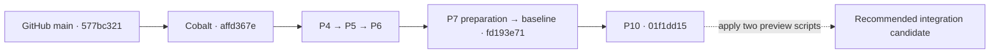

# GameTime consolidation map

Audited September 12, 2026, America/Chicago. This is an inspected snapshot and a
recommended consolidation plan. No product branch, checkout, remote, database,
device, or running preview was changed by this audit.

**The completed work can follow one path onto `main`: P10 at `01f1dd15`, then the
two uncommitted preview-tool fixes.** P10 is a direct descendant of GitHub `main`,
44 commits ahead with no commits exclusive to `main`. The old copies require
preservation and selective review; merging every branch would combine competing
implementations and cancelled work.

## Where we stand

| Work | Actual state | Consolidation treatment |
| --- | --- | --- |
| GitHub and original checkout `main` | `577bc321`, September 6; older weekly implementation | Advance through the current Beta history after preserving the dirty checkout. |
| Current Beta foundation and Cobalt | Implemented; `codex/beta-working-baseline` at `fd193e71` | Already contains the Cobalt → completed P4 → P5 → P6 → P7-preparation chain. |
| P4 / P5 / P6 | Locally completed: scoped locks and workers, bounded queries, private 250-person community | Already included in P10. No separate merges or reruns of their implementation prompts. |
| P7 | Prepared signed Debug build; physical sessions and all four source acceptances pending | Keep preparation. Do not label P7 physically complete. |
| P10 | Two committed additions after the baseline, ending at `01f1dd15` | Include. Independent hosted/support/retention preparation is complete; actual hosted operation remains pending. |
| Local Cobalt preview | Two modified Python scripts; prior task recorded a successful build and interactive fictional journeys | Preserve and commit the reusable resource-selection fixes. They apply cleanly to P10. Runtime accounts and credentials are separate from source consolidation. |
| P8 / P9 | Real ingestion, adapters, and integration still remain | Depend on accepted source policies. Ordinary signed-in code still constructs `UnavailableChallengeV1Client`. |
| P11–P13 | Hosted capacity/recovery, integrated release and human acceptance remain | Future work. All 18 readiness entries are still false. |

The newer local preview has friend invitations, individual targets, independent
consent, scheduled/active challenges and personal goals. Those fictional journeys
do not establish normal signed-in or real Health functionality. Cobalt is the
implemented default; this inventory does not settle the owner's ongoing design
review or authorize removing historical Personal agreements.

## The loose ends

**Three of the 22 checkout locations are dirty.** Counts below enumerate files,
including untracked files individually, before this report was added.

| Checkout | Uncommitted work | Disposition |
| --- | --- | --- |
| [Original GameTime](/Users/user/Documents/GitHub/GameTime) | 41 modified, 52 deleted, 158 untracked files | Preserve a complete archive. Review useful copy/docs/assets individually. |
| [Current Beta](/Users/user/firstmate-workspace/projects/gametime-beta) | `scripts/beta-native-smoke.py` and `scripts/beta-preview.py` | Carry both onto the integration branch after checking for newer edits. |
| [Earlier Beta1 policy worktree](/Users/user/firstmate/projects/beta1-policy/GameTime) | Eight modified documents and one untracked plan | Preserve with its separate Beta1 implementation; reconcile useful decisions rather than overwriting current plans. |

A scratch application of the original tracked patch to P10 produced conflicts in
`CLAUDE.md`, `DECISIONS.md`, `PLAN.md`, `PROJECT_MEMORY.md`, `README.md`, and
`docs/BUSINESS_MODEL.md`. Other changes can apply mechanically while still being
wrong for the current product: for example, old native edits remove simulated-money
disclosures and alter consent copy. The 52 asset deletions also need an intentional
disposition. A blanket stash-and-reapply would not resolve these issues.

The main naming is misleading: the Beta repository's own `main` is still
`affd367e`, while the original/GitHub `main` is `577bc321`. **Beta's `origin` points
to the original local GameTime folder, not GitHub.** Its P10 branch is stored in
the durable Beta Git repository even though its working files are under `/tmp`.

## Recommended route to one main checkout

1. **Preserve the loose work first.** Save named, durable archives of the original
   and Beta1 dirty copies, including untracked design assets and tracked deletions.
   Preserve the other branch tips in refs or a verified Git bundle. Keep ignored
   credentials and local database/device state outside Git. Recheck the separate
   “Set local admin credentials” task before changing its resources; it was active
   at the first app inventory.
2. **Prepare `codex/consolidate-main` in the GitHub-connected repository.** Import
   P10's exact committed tip from the local Beta repository into a clean integration
   checkout. Its ancestry already carries all 44 new commits and their provenance.
   Apply the two preview-tool changes and commit them separately. No P2/P4/P5/P6/P7
   branch merges are necessary.
3. **Make the instructions match the destination.** Reconcile the current entry
   documents around one working folder and branch, include P10's status and the
   preview launcher, and retain dated acceptance reports as history. Selectively
   retain useful original docs/assets; do not import old plans or the competing
   Beta1 application wholesale.
4. **Check the final integration once.** Check migration identities and closed
   readiness settings, build the native target, and run the focused preview journey
   with the committed tooling. Use existing P4–P6 acceptance as prior evidence;
   investigate concrete failures without restarting cancelled gate infrastructure.
   Restore GitHub CI availability for a fresh remote result. The full physical and
   release matrix remains later work.
5. **Land and simplify.** After that candidate is accepted, advance `main` with
   the useful history preserved and publish through the GitHub-connected repository
   when requested. Make `/Users/user/Documents/GitHub/GameTime` on `main` the sole
   active development checkout. Retire extra worktrees only after their unique work
   is archived and their task/resource use has ended.

This sequence is a recommendation. This audit did not create a product integration
branch, move `main`, push, archive user work, stop services, or delete any checkout.

## Complete checkout inventory

The scan covered the known Codex, Treehouse, Firstmate, GitHub and temporary
checkout locations, then followed every discovered Git worktree registration.
It found **22 GameTime locations across 11 Git object stores**; every registered
location was accounted for. Third-party Swift package checkouts are excluded.
“Included” below means commit ancestry unless a content-copy exception is stated.

| Location | Branch / HEAD | State and treatment |
| --- | --- | --- |
| [Original](/Users/user/Documents/GitHub/GameTime) | `main` · `577bc321` | Dirty; archive/selectively reconcile, then use as final working folder. |
| [Canonical Beta](/Users/user/firstmate-workspace/projects/gametime-beta) | `codex/beta-working-baseline` · `fd193e71` | Dirty: two preview scripts. Current base; two commits behind P10. |
| [P10](/private/tmp/gametime-p10-20260912) | `codex/hosted-preparation-p10` · `01f1dd15` | Clean; recommended committed tip. |
| [Cobalt](/private/tmp/gametime-crisp-cobalt-20260911) | `codex/crisp-cobalt-ui` · `affd367e` | Clean; included. |
| [P4 completion](/private/tmp/gametime-simplify-20260911-byc27c1u/GameTime) | `codex/lean-beta-preparation` · `369e7b90` | Clean; included. |
| [P5](/private/tmp/gametime-p5-20260911/GameTime) | `codex/bounded-queries-p5` · `e16cff4b` | Clean; included. |
| [P6](/private/tmp/gametime-p6-20260912/GameTime) | `codex/private-community-p6` · `39e5f202` | Clean; included. |
| [P7](/private/tmp/gametime-p7-20260912/GameTime) | `codex/physical-source-p7` · `1b8fe6a3` | Clean; preparation included. Preserve any separately referenced build artifacts. |
| [Consolidation copy](/private/tmp/gametime-baseline-consolidation-20260912/GameTime) | `codex/beta-working-baseline` · `fd193e71` | Clean; duplicate checkpoint. |
| [Treehouse 1](/Users/user/.treehouse/gametime-beta-7b9cca/1/gametime-beta) | `fm/gametime-beta-finish-b7` · `cf82e25b` | Clean; included. |
| [Treehouse 2](/Users/user/.treehouse/gametime-beta-7b9cca/2/gametime-beta) | `fm/gametime-beta-real-validation-c8` · `9c84459e` | Clean; included. |
| [Treehouse 3](/Users/user/.treehouse/gametime-beta-7b9cca/3/gametime-beta) | Detached · `1512009c` | Clean; duplicate candidate-gate checkpoint. Retain as history. |
| [Treehouse 4](/Users/user/.treehouse/gametime-beta-7b9cca/4/gametime-beta) | `fm/gametime-beta-load-prep-e2` · `e3b6b92c` | Clean; P2 load content copied into current history. Do not merge whole branch. |
| [Treehouse 5](/Users/user/.treehouse/gametime-beta-7b9cca/5/gametime-beta) | `fm/gametime-beta-health-prep-e3` · `a18f00fa` | Clean; included. |
| [Treehouse 6](/Users/user/.treehouse/gametime-beta-7b9cca/6/gametime-beta) | `fm/gametime-beta-contract-d9` · `7c34d52b` | Clean; included. |
| [Treehouse 7](/Users/user/.treehouse/gametime-beta-7b9cca/7/gametime-beta) | `fm/gametime-beta-candidate-gate-d9` · `1512009c` | Clean; historical gate infrastructure, not accepted current product work. |
| [Treehouse 8](/Users/user/.treehouse/gametime-beta-7b9cca/8/gametime-beta) | `fm/gametime-beta-verification-recovery-e10` · `ff71ee28` | Clean; cancelled recovery, 37 commits outside P10. Preserve, do not merge. |
| [Treehouse 9](/Users/user/.treehouse/gametime-beta-7b9cca/9/gametime-beta) | `fm/gametime-beta-scoped-locks-p4` · `d0742eac` | Clean; patch-equivalent to imported `9e9ea93c`, then corrected by completed P4. |
| [P2 comparison copy](/private/tmp/gametime-p4-final-20260911/p2-source) | Detached · `e3b6b92c` | Clean; duplicate P2 evidence source. |
| [Earlier weekly clone](/Users/user/firstmate/projects/GameTime) | `codex/weekly-local-roadmap` · `6476d474` | Clean; pre-final-PR history. Twenty of its 21 divergent commits are patch-equivalent; merged PR17 has later fixes. Retain archive. |
| [Earlier Beta1 policy](/Users/user/firstmate/projects/beta1-policy/GameTime) | `codex/beta1-policy-foundation` · `0f549100` | Dirty; 19 divergent commits and a separate Beta1 app/domain. Preserve; inspect particular desired features separately. |
| [Earlier source investigation](/Users/user/firstmate/projects/pr17-final/GameTime) | `codex/weekly-steps-source-investigation` · `c452a662` | Clean; two unique commits including a standalone investigation app absent from the current product. Preserve as reference; current P7 uses its own integrated investigation. |

Branches without a separate current checkout also remain: `codex/ios-accessibility-audit`
at `8e2e267d` has two divergent older commits; `daybreak-ledger-tokens` at `0957d075`
has two (GitHub retains its earlier `ea16beb6` tip). These are selective-review
archives, not automatic additions to Cobalt. GitHub's old copy-review branch
`8404fbb5` and weekly PR17 tip `fddcbcd0` are already ancestors of P10.

## Verification and source records

- Fresh local ancestry and branch comparisons confirm `main...P10 = 0 / 44` and
  `baseline...P10 = 0 / 2`. The main-to-P10 diff spans 708 files, including extensive
  reports, design assets and test evidence; this is not a fresh line-by-line review
  of all 44 commits.
- P2's entire `docs/load` tree is byte-identical in P10. All existing
  `scripts/challenge-load` files are retained; P4 adds `p4_compare.py`.
- The preview patch applies to P10 in an isolated scratch Git index. The combined
  tree changes only the two scripts, passes whitespace checks, and both scripts
  parse successfully. No current app/database/native test suite was run by this audit.
- GitHub branch tips were checked live. There are no open PRs. All four jobs in
  [the latest main CI run](https://github.com/m1jenkins/GameTime/actions/runs/34061887531)
  were prevented from starting by an account billing/spending-limit issue; this is
  not a test failure. The preceding PR17 run succeeded, but neither run validates
  the 44 newer local commits.
- Current implementation evidence: [baseline](/Users/user/firstmate-workspace/projects/gametime-beta/docs/WORKING_BASELINE.md),
  [P4](/Users/user/firstmate-workspace/projects/gametime-beta/outputs/reports/2026-09-11-p4-completion.md),
  [P5](/Users/user/firstmate-workspace/projects/gametime-beta/outputs/reports/2026-09-11-p5-completion.md),
  [P6](/Users/user/firstmate-workspace/projects/gametime-beta/outputs/reports/2026-09-12-p6-completion.md),
  [P7 preparation](/Users/user/firstmate-workspace/projects/gametime-beta/outputs/reports/2026-09-12-p7-preparation.md),
  [P10](/private/tmp/gametime-p10-20260912/outputs/reports/2026-09-12-p10-completion.md).
- [Machine-readable audit](../../outputs/reports/2026-09-12-worktree-consolidation-audit.json)
  preserves the exact checkout/ref/file inventory and scratch-check results.
