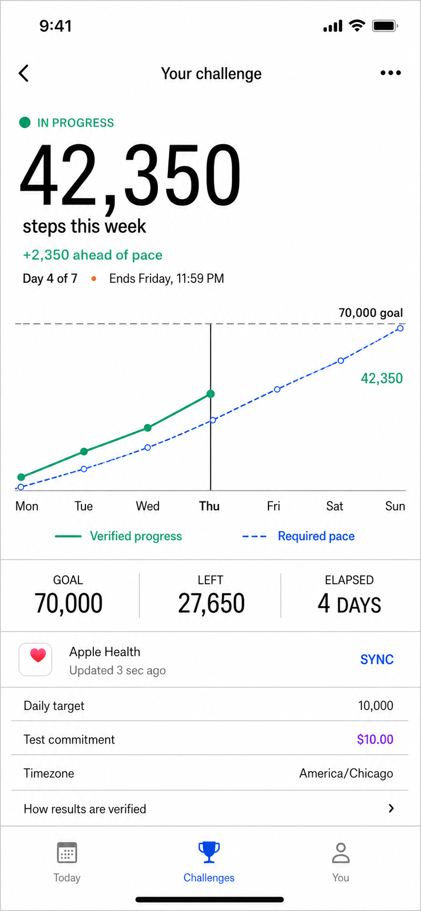
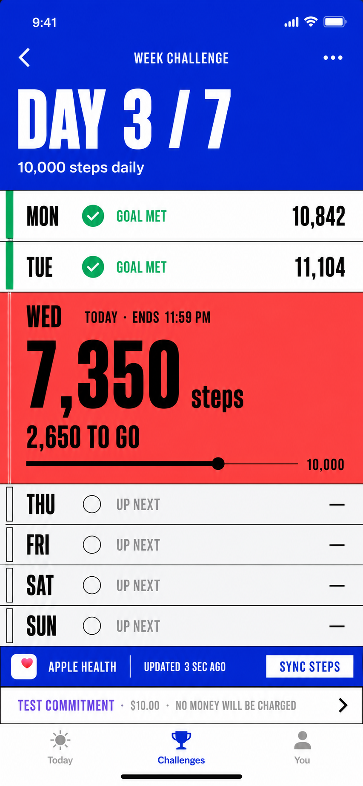
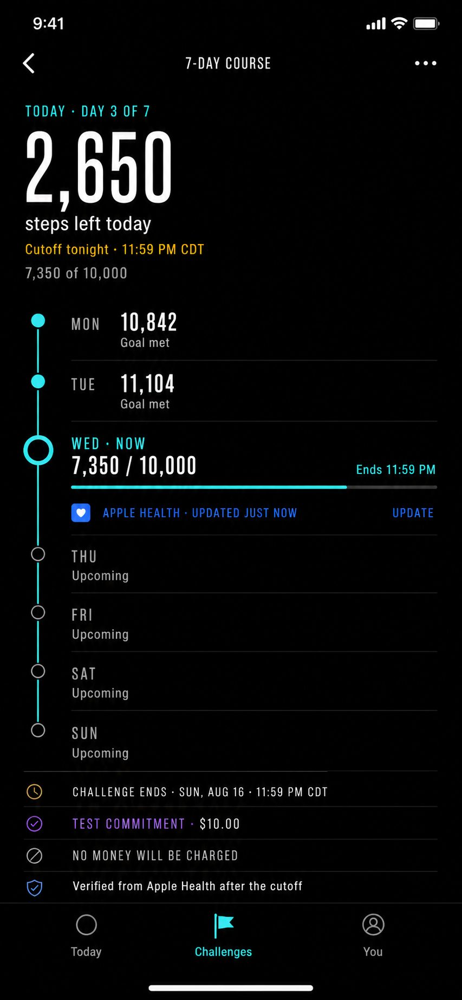

# GameTime challenge screen: zero-beige reset

> **Scope — September 4, 2026.** These are visual references for the
> Personal steps implementation, not the future product roadmap. Their
> solo-only/no-opponent constraints do not override the adopted friend-duel and
> performance-commitment model in [BUSINESS_MODEL.md](../BUSINESS_MODEL.md).
> Mockups are not proof of implemented features, verified results or money.
> Preserve existing app behavior until a separate implementation task changes it.

Status: visual direction and interaction specification. No production SwiftUI has been changed.

## Decision

The previous warm editorial options are superseded. This reset removes the beige Daybreak canvas, soft card stack, oversized commitment tile, and repeated rounded modules.

The new thesis is:

**A live performance instrument with finance-grade numerical confidence and fitness-grade immediacy.**

The shipping repository calls the product GameTime Personal v2. These concepts do not reintroduce the former Better Bet name, the dormant social duel, balances, winnings, rankings, or unsupported fitness data.

## What transfers from the references

The goal is to translate principles, not reproduce brand signatures.

| Reference | Transfer | Deliberately avoid |
| --- | --- | --- |
| Robinhood | One dominant number, chart-led hierarchy, tabular figures, flush data rows, one decisive accent | Robin Neon, feather marks, ticker chips, trade controls, gains/loss framing, exact chart geometry |
| Strava | Athletic immediacy, strong activity states, result-first hierarchy, the week as a lived sequence | Strava Orange, routes, kudos, crowns, leaderboards, social shame |
| WHOOP | Continuous dark instrumentation, current state plus contributing evidence, dense readable telemetry | Recovery or Strain scores, circular score system, traffic-light interpretation |
| Cash App | Blunt simplicity, fearless solid color, one task per screen, oversized numbers | Cash App Green, dollar-sign navigation, payment or balance metaphors |
| Apple Fitness | True-black legibility, bright semantic data color, humane current/completed states | Activity Rings, award medals, ring colors, ring motion |

Current reference material:

- [Robinhood current iOS presentation](https://apps.apple.com/us/app/robinhood-trading-investing/id938003185)
- [Robinhood Legend charts on mobile](https://robinhood.com/us/en/newsroom/introducing-robinhood-legend-charts-on-mobile/)
- [Strava current iOS presentation](https://apps.apple.com/us/app/strava-run-bike-walk/id426826309)
- [Strava goals](https://support.strava.com/en-us/articles/15401694-goals-on-the-strava-app)
- [WHOOP product model](https://www.whoop.com/us/en/thelocker/how-whoop-measures-recovery-sleep-and-strain-for-performance/)
- [Cash App current iOS presentation](https://apps.apple.com/us/app/cash-app/id711923939)
- [Apple Fitness current iOS presentation](https://apps.apple.com/us/app/apple-fitness/id1208224953)

## Product truth that every option preserves

The screen must answer, in this order:

1. What remains now?
2. When is the exact local cutoff?
3. Is Apple Health current?
4. How does today fit the seven-day challenge?
5. What are the test terms and verification rule?

Supported data:

- Seven daily step totals.
- Daily goal and verified progress.
- Current day and exact local cutoff.
- Challenge end and frozen timezone.
- Apple Health source and freshness.
- Test commitment and verification rule.

Unsupported and intentionally absent:

- Intraday curves, route maps, calories, heart rate, readiness, forecasts, streaks, walking-time estimates, real balances, returns, winnings, opponents, standings, or social completion.

## Option 1: Signal Sheet

Best for: users who want the fastest read and the strongest finance-app confidence.

### Composition

- Cool white, edge-to-edge canvas.
- Weekly total is the opening headline, with ahead/behind pace as a labeled secondary result.
- The verified-progress plot and required-pace plot occupy the full width.
- Goal, remaining, and elapsed are a quote rail, not cards.
- Apple Health and the terms are flush ledger rows.
- Commitment money receives a violet semantic label but no display treatment.

### Signature

The chart is the surface. Type, plotted data, hairlines, and one compact action provide the structure.

### Palette seed

- Canvas: cool white, approximately #F8FAFC.
- Ink: #080B10.
- Verified movement: emerald-teal.
- Required pace and action: cobalt.
- Test commitment: violet.
- Deadline: amber.

### Tradeoff

This is the most analytical option. It is less emotionally athletic, and the chart must collapse to a textual summary plus vertical daily rows at accessibility text sizes.

## Option 2: Training Splits

Best for: the most energetic, differentiated daily challenge experience.

### Composition

- The seven days are the interface, rendered as full-width split rows.
- Completed days are compressed factual rows.
- Today expands into a saturated live band containing the only large metric and progress rule.
- Future days remain quiet and structurally present.
- Apple Health is a cobalt utility rail attached to the live day.
- Test commitment is a one-line receipt after the course, never a hero.

### Signature

This behaves like an athletic lap sheet rather than a dashboard. There is no hero card, weekly card, Health card, or terms card.

### Palette seed

- Header and source utility: ultramarine.
- Live day: hot coral-red.
- Completed: green plus checkmark and Goal met label.
- Future: cool white and graphite.
- Test commitment: violet.

### Tradeoff

This is the boldest option and the current recommendation. The saturated current-day band needs rigorous contrast testing, and its compressed type should relax at larger Dynamic Type sizes instead of scaling down.

## Option 3: Night Course

Best for: a premium, focused, lower-stimulation performance view.

### Composition

- One uninterrupted obsidian canvas from status bar to tab bar.
- Today’s remaining steps and cutoff open the screen.
- A vertical course rail joins seven explicit checkpoints.
- The current checkpoint expands inline for progress and Apple Health freshness.
- Challenge end, test commitment, no-charge disclosure, and verification form a divider-only receipt at the finish.

### Signature

The screen reads top to bottom like a course already in progress. Position and continuity replace containers.

### Palette seed

- Canvas: near-black, approximately #050608.
- Primary text: cool white.
- Live movement: electric aqua.
- Source utility: cobalt.
- Test commitment: violet.
- Deadline: amber.

### Tradeoff

Dark UI carries a stronger performance tone and may feel less casual. It also requires a deliberate app-wide appearance decision; forcing only this destination dark would be visually discontinuous.

## Recommendation

Take **Training Splits** into an interactive SwiftUI prototype first.

It is the cleanest break from the existing app because the week becomes the layout itself. It also adapts naturally to large text: each split can grow vertically while retaining day, state, and value in VoiceOver order.

Borrow two details from the other options:

- Use Signal Sheet’s ledger treatment for exact terms.
- Offer Night Course as the eventual dark-appearance expression of the same day-state model.

Do not merge all three visual systems into one screen. Their value is their structural difference.

## Shared interaction guidance

### Healthy, fresh state

- Show Apple Health source and Updated just now.
- Use a compact Update or Sync steps action near freshness.
- Keep animation static by default; a pulse is not needed to prove liveness.

### Stale or missing data

- Strengthen the Update action only when freshness becomes the active problem.
- Keep last-known steps visible and clearly label their age.
- Offer Health access help or retry without replacing the whole screen with an error.

### Scheduled

- Replace remaining-today hierarchy with exact start timing and what begins counting.
- Keep the seven-day structure visible but inactive and labeled.

### Completed

- Freeze the result.
- Replace the live action with evidence and review eligibility.
- Avoid confetti, medals, price-like gains, and automatic re-engagement.

### Cancellation

- Keep cancellation in the overflow or expanded details.
- Preserve confirmation and recovery behavior.
- Do not place it above pace guidance during a normal active state.

## Accessibility and trust requirements

- Never communicate completed/current/upcoming, ahead/behind, or fresh/stale with color alone.
- Use tabular figures for steps, dates, times, and money.
- Keep controls at least 44 by 44 points.
- At accessibility text sizes, prefer full-width stacked rows over compressed columns or shrinking type.
- Give charts a concise textual summary and expose daily points in logical VoiceOver order.
- Keep Reduce Motion static and preserve meaning without transition.
- Test Increase Contrast on cool white and true black.
- Say Apple Health source or verified from Apple Health after cutoff; do not imply that Apple certifies the result.
- Label the amount Test commitment and keep No money will be charged visible before any confirmation.
- Preserve exact local cutoff, challenge end, timezone, verification cutoff, and review rule when authoritative data exists.

[Apple accessibility guidance](https://developer.apple.com/design/human-interface-guidelines/accessibility/) and [Differentiate Without Color Alone](https://developer.apple.com/help/app-store-connect/manage-app-accessibility/differentiate-without-color-alone-evaluation-criteria) are acceptance criteria, not decoration guidance.

## Implementation sequence after direction approval

1. Build the chosen structure behind a fixture-only prototype without changing domain or navigation contracts.
2. Define semantic roles for movement, required pace, source freshness, deadline, test commitment, completion, and recovery.
3. Implement default and accessibility-size layouts together.
4. Render fresh, stale, no-data, scheduled, completed, and cancellation-recovery fixtures.
5. Validate on the existing compact simulator and with VoiceOver, Reduce Motion, and Increase Contrast.
6. Only then migrate the approved structure into the production challenge detail.

## Artifact note

These raster screens are design references, not shipping assets. Their complete generation prompts are in [CHALLENGE_SCREEN_IMAGE_PROMPTS.md](CHALLENGE_SCREEN_IMAGE_PROMPTS.md).
